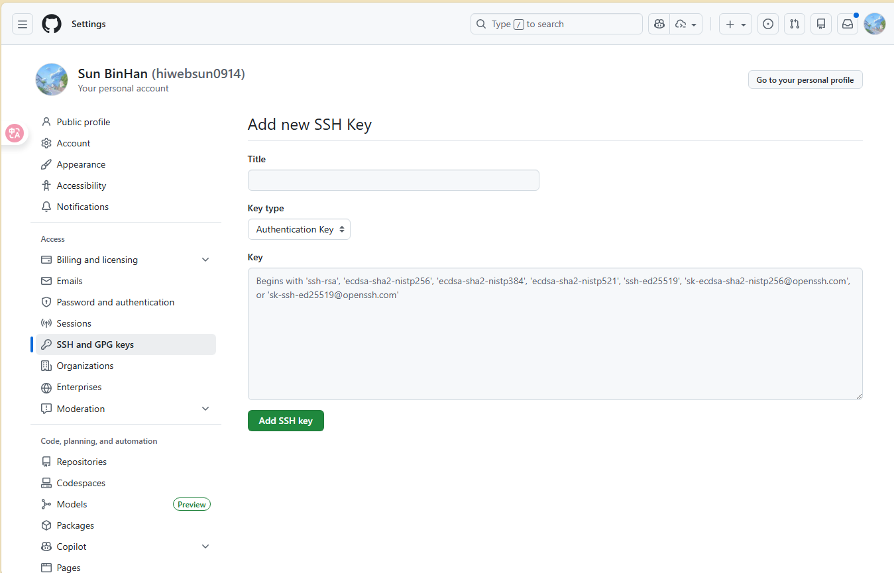
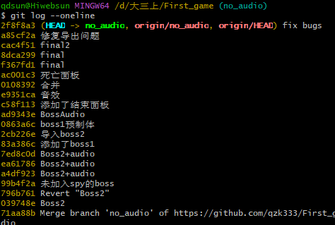

### 1) 一次性基础配置
第一次用 Git 先设置用户名邮箱；否则提交记录会乱，协作也不好追踪。

```bash
git config --global user.name "YourName"
git config --global user.email "you@example.com"
git config --global init.defaultBranch main
```

> + `git config --global user.name "YourName"`：设置你在 **Git 提交记录里显示的作者名**（commit 的 Author/Committer name）。以后你在任何仓库里 `git commit`，默认都会写这个名字，用于追踪“是谁提交的”。
> + `git config --global user.email "you@example.com"`：设置你在 **Git 提交记录里显示的作者邮箱**。同样是写进每次 commit 的元数据里，GitHub 会用它做身份关联（例如显示你的头像、标记为你的贡献；前提是该邮箱在 GitHub 账号里可验证/可匹配）。
> + `git config --global init.defaultBranch main`：设置你以后执行 `git init` 时 **默认创建的初始分支名**。默认从老的 `master` 改为 `main`，避免你新建仓库后还要手动改分支名或和远程默认分支不一致。
>

---

### 2) 配置 SSH
核心就是：生成密钥 → 把公钥加到 GitHub → 本地加载私钥 → 测试连通性。

```bash
# 生成 SSH 密钥（一路回车即可）
ssh-keygen -t ed25519 -C "you@example.com"

# 启动 ssh-agent 并加入私钥（Git Bash）
eval "$(ssh-agent -s)"
ssh-add ~/.ssh/id_ed25519

# 打印公钥：复制输出粘贴到 GitHub
cat ~/.ssh/id_ed25519.pub

# 测试 SSH 是否通
ssh -T git@github.com
```

<!-- 这是一张图片，ocr 内容为：O 白 8 十 SETTINGS TYPEARCH SUN BINHAN (HIWEBSUN0914) GO TO YOUR PERSONAL PROFILE YOUR PERSONAL ACCOUNT R PUBLIC PROFILE ADD NEW SSH KEY 中产 ACCOUNT TITLE APPEARANCE ACCESSIBILITY NOTIFICATIONS KEY TYPE AUTHENTICATION KEY ACCESS KEY BILLING AND LICENSING BEJISS WITH,SSHISS] ECDSO SHA2-'SP256,          ECDSO , ECDSO SHA2-ISP521;SSH ED3519:; EMAILS OR'SK-SSH-ED25519@OPENSSH.COM' PASSWORD AND AUTHENTICATION ((4) SESSIONS SSH AND GPG KEYS 阅 ORGANIZATIONS ENTERPRISES MODERATION ADD SSH KEY CODE,PLANNING,AND AUTOMATION REPOSITORIES CODESPACES MODELS PREVIEW PACKAGES 中国 COPILOT PAGES -->


>  SSH（Secure Shell）可以理解为一种**加密的远程连接与身份认证协议**。在 Git/GitHub 的场景里，它主要用来让你在本地执行 `git clone / pull / push` 时，GitHub 能确认“你是谁、是否有权限”，并且整个通信过程是加密的。  
>

---

### 3) Clone 仓库（把 GitHub 项目拉到本地）
clone 用 SSH 地址最省事，格式固定是 `git@github.com:用户/仓库.git`。

```bash
git clone git@github.com:USER/REPO.git
cd REPO
```

<!-- 这是一张图片，ocr 内容为：台 HIWEBSUN0914 / SYSULISE CAMPUS GUIDE WEB APPLICATION O 8 十 TYPE TO SEARCH 中WIKI 田PROJECTS SETTINGS 87 PULL REQUESTS SECURITY INSIGHTS ACTIONS CODE ISSUES SYSU ISE CAMPUS GUIDE WEB APPLICATION 0 FORK  0 PIN WATCH STAR PUBLIC G9 2 BRANCHES ABOUT ADD FILE 0 TAGS CODE MAIN GO TO FILE 中山大学智能工程学院迎新校园图鉴网页 CODESPACES LOCAL HIWEBSUN0914 MERGE PULL REQUEST #1 FROM HIWEBSUN0914/CODEX/UPDATE 端 CLONE P README DIST FIRST COMMIT GITHUB CLI SSH HTTPS ACTIVITY FIRST COMMIT NODE_MODULES 合 ) STARS GIT@GITHUB.COM:HIWEBSUNE914/SYSU ISE CAMPUS GU: FIRST COMMIT SRC O WATCHING USE A PASSWORD-PROTECTED SSH KEY. 0 FORKS FIRST COMMIT ENV.PRODUCTION 甬 OPEN WITH GITHUB DESKTOP FIRST COMMIT ESLINTIGNORE RELEASES DOWNLOAD ZIP FIRST COMMIT NO RELEASES PUBLISHED GITIGNORE CREATE A NEW RELEASE UPDATE README WITH PROJECT DETAILS README.MD 1 HOUR AGO PACKAGES 4 MONTHS AGO FIRST COMMIT INDEX.HTML NO PACKAGES PUBLISHED 4 MONTHS AGO FIRST COMMIT PACKAGE-LOCKJSON PUBLISH YOUR FIRST PACKAGE 4 MONTHS AGO FIRST COMMIT PACKAGE.JSON LANGUAGES 4 MONTHS AGO FIRST COMMIT VITE.CONFIG.JS VUE 87.6% JAVASCRIPT 10.3% CSS 1.1% OTHER 1.0% README SUGGESTED WORKFLOWS  BASED ON YOUR TECH STACK -->


> `git clone`后面的链接从克隆的仓库中获取
>
> `cd` 是打开文件夹的代码，所以后面的内容根据文件夹名来修改
>

---

### 4) 新建分支并开发（标准协作方式）
不要直接在 `main` 上改；先从 `main` 拉分支，再提交再推送，最后去 GitHub 开 PR 合并。

```bash
git checkout main
git pull origin main
git checkout -b feature/xxx
```

> + `git checkout main`：把你当前所在的分支**切换到 **`**main**`** 分支**。作用是确保你接下来是在主分支的基础上操作（而不是在别的分支上）。
> + `git pull origin main`：从远程仓库 `origin` 把 `main` 分支的最新提交**拉到本地并合并到你当前的 **`**main**`。等价于“先获取更新（fetch），再合并（merge）”，让你的本地 `main` 保持最新。
> + `git checkout -b feature/xxx`：从当前所在分支（此时通常是最新的 `main`）**创建一个新分支**叫 `feature/xxx`，并立刻切换过去。用途是：你在这个新分支上开发功能，不直接污染 `main`，后续通过 PR 再合并回 `main`。
>

---

### 5) 提交与推送（把改动同步到 GitHub）
提交的关键是：先 `add` 进暂存区，再 `commit` 生成版本快照，再 `push` 到远程分支。

```bash
git status
git add .
git commit -m "feat: xxx"
git push -u origin feature/xxx
```

> + `git status`：查看当前仓库状态，主要看三件事：你在哪个分支、哪些文件被修改/新增/删除、哪些已暂存（staged）哪些还没暂存。用于确认“我准备提交什么”。
> + `git add .`：把**当前目录及子目录**里所有改动（新增/修改/删除）加入**暂存区**。暂存区就是“这次准备提交的文件清单”。（注意：只会添加未被 `.gitignore` 忽略的文件。）
> + `git commit -m "feat: xxx"`：把暂存区的内容生成一次**提交（commit）**，并写提交说明。`feat:` 常表示“新增功能”，`xxx` 写你这次做的具体内容。提交后，这个版本就能被回溯、对比、回滚。
> + `git push -u origin feature/xxx`：把本地的 `feature/xxx` 分支提交**推送到远程仓库**`origin` 的同名分支，并用 `-u` 设置**上游跟踪关系**。设置后以后你在该分支只需要 `git push` / `git pull`，Git 就知道默认对应远程的哪个分支。
>

---

### 6) 同步远程更新（推荐先 fetch，再决定怎么合并）
`fetch` 只更新远程跟踪分支，不会动你当前代码；更安全。需要把更新并入当前分支时再 merge/rebase。

```bash
git fetch origin
git diff origin/main

# 合并（保留合并节点，协作常用）
git merge origin/main

# 或：变基（线性历史，熟练后再用）
git rebase origin/main
```

> `git fetch origin` 是从远程仓库 `origin` 把所有最新提交和分支指针“下载到本地”，但**不改动你当前分支的代码**；它只更新类似 `origin/main` 这种“远程跟踪分支”，因此属于最安全的同步动作。
>
> `git diff origin/main` 是把你当前工作分支与远程主分支 `origin/main` 做差异对比，用来确认你现在相对主分支到底改了哪些内容、是否落后、是否会产生冲突（也可用来合并前先心里有数）。
>
> `git merge origin/main` 的意思是把远程主分支的最新改动**合并进你当前分支**，合并后历史里通常会出现一个“合并提交”（merge commit，除非可以快进 fast-forward），好处是分支合并关系清晰、团队协作中较直观；如果双方改动碰到同一处，会提示冲突，需要你手动解决后再 `add` + `commit` 完成合并。
>
> `git rebase origin/main` 则是把你当前分支的提交“搬到”最新的 `origin/main` 之后，形成更线性的历史；效果类似“先把我的改动暂时拿开 → 更新到最新主分支 → 再把我的提交一个个重新应用上去”，因此更容易在过程中多次遇到冲突，需要逐个解决并 `git rebase --continue`；同时它会改写提交 ID，所以**不要在已经推送且多人共用的分支上随意 rebase**。
>

---

### 7) PR 合并后，把本地 main 拉到最新
你在 GitHub 上把 PR 合并进 main 后，本地要 pull 一次把最新 main 拉下来。

```bash
git checkout main
git pull origin main
```

---

### 8) 常用回退/撤销
撤销分三类：撤销工作区、撤销暂存、撤销提交；公共分支优先用 `revert`，不要乱 `reset --hard`。

```bash
# 撤销工作区改动（未 add）
git restore .

# 取消暂存（已 add 未 commit）
git restore --staged .

# 回滚某次提交（推荐：会生成一个“反向提交”）
git revert <commit_hash>

# 强制回退到某提交（慎用：改历史，尤其别在共享分支用）
git reset --hard <commit_hash>
```

> `git restore .` 用于**撤销工作区里尚未暂存（未 **`**git add**`**）的改动**：它会把当前目录下所有文件恢复到“上一次提交（或上一次暂存）时的状态”，相当于把你这次手滑改乱的内容直接丢掉；注意这一步对未保存到提交/暂存中的修改是不可逆的。
>
> `git restore --staged .` 用于**取消暂存**：你之前 `git add` 把改动放进暂存区了，但还没 `commit`，这条命令会把这些文件从暂存区撤回到工作区（改动仍然保留，只是不再算“准备提交”）；常见场景是你 add 多了文件，想重新选择提交内容。
>
> `git revert <commit_hash>` 用于**回滚某一次提交**：它不会删除历史，而是基于你指定的那次提交生成一个新的提交，这个新提交的内容刚好把那次提交的改动“反向抵消”（所以叫“反向提交”）；因此它适合在 `main` 这种共享分支上使用，因为历史不被改写，团队协作更安全。
>
> `git reset --hard <commit_hash>` 用于**强制把当前分支回退到某个历史提交**：它会直接移动分支指针到指定提交，并且把暂存区和工作区都重置成该提交的内容，等于把那之后的提交和本地改动都“抹掉”；这会改写历史，如果你对已经推送到远程的分支这么做，通常还需要强推（force push）且容易影响他人，所以只建议用于你个人分支或你非常确定的场景。
>
> `<commit_hash>` 指的是某一次提交的“唯一标识符”（提交哈希），是一串十六进制字符串，例如 `a3f5c2d1e9...`；它用来精确定位你要回滚/回退的那一次提交。
>

---

### 9) 查看提交历史
`git log` 用来**查看提交历史**。

```bash
# 最常用：一行一个提交，可以看到 commit_hash，按q退出
git log --oneline

# 更直观：显示分支/合并关系的“提交树”
git log --oneline --graph --decorate --all

# 只看最近 20 条
git log --oneline -n 20

# 只看某个文件的提交历史
git log --oneline -- path/to/file

# 查找提交信息里包含某关键字的提交
git log --oneline --grep="keyword"
```

<!-- 这是一张图片，ocr 内容为：(NO_AUDIO) QDSUN@HIWEBSUN MINGW64 D/大三上 .GAME $ GIT LOG --ONELINE 2F8F8A3 (HEAD -> NO-AUDIO, ORIGIN/NO-AUDIO, ORIGIN/HEAD) FIX BUGS A85CF2A修复导出问题 CAC4F51 FINAL2 8DCA299 F1NAL F367FD1 FINAL AC001C3死亡面板 合并 0108392 E9351CA音效 添加了结束面板 C58F113 AD9343E BOSSAUDIO 0863A6C BOSS1预制体 2CB226E 导入BOSS2 83A386C添加了BOSS1 7ED8C0D D BOSS2+AUDIO EA61786 BOSS2+AUDIO A4DF923 BOSS2+AUDIO 99B4F2A未加入SPY的BOSS 796B761 REVERT"BOSS2" 039748E BOSS2 71AA88B MERGE BRANCH 'NO_AUDIO' HTTPS://GITHUB.COM/QZK333/FIRST_ -->


你在 `git log --oneline` 里看到的每行开头那串字符（例如 `a1b2c3d`）就是常说的 `commit_hash`（通常是完整哈希的前几位缩写），可以直接拿去配合 `git revert <commit_hash>` 或 `git reset --hard <commit_hash>` 使用。

---

### 10) 本地代码添加到Github
1）进入你的本地项目目录

```bash
cd /path/to/your/project
```

2）初始化 Git（如果还没初始化）

```bash
git init
```

3）添加忽略文件（建议）并首次提交

```bash
git add .
git commit -m "init"
```

4）绑定远程仓库（把地址换成你自己的 SSH 地址）

```bash
git remote add origin git@github.com:USER/REPO.git
```

5）推送到 GitHub（第一次推送需要设置上游）

```bash
git branch -M main
git push -u origin main
```

---


