🪄 **教程编号：**轻坊探知·第1期

🎯 **教程目标**：带你30分钟了解如何从“我有个想法”到“我有张证书”，搞懂如何申请专利和软件著作，搞清申请成本、材料内容与申请报销流程，并且带你了解学校报销流程，零基础也能亲手申报！

📚 **关联课程**：《知识产权》

⏱️**预计阅读时间：30分钟。**

✍️ **教程字数：7800字**

💻 **依托平台**：语雀（教程撰写）、[国家知识产权局](https://www.cnipa.gov.cn/)（专利申请）、[中国版权保护中心](https://www.ccopyright.com.cn/)（软著申请）

💴 **预计实操成本：**见下文

| **内容** | **成本** | **备注** |
| :---: | :---: | :---: |
| **发明专利代理费用（官方代理）** | **3960元** | 仅为参考价格 具体渠道不同会有波动 |
| **软件著作权申请（自备材料）** | **0元** | |
| **总计** | **0-4000元** | |

>  代理是一项专业服务。在申请专利、软著权利保护方面，你只需提交能准确表达方案要点的材料，代理机构将完成创新性评估、规范化文件撰写，并代为办理全流程申报与跟进。  
>
> **为什么需要代理？****专业、省事、(快捷)**
>
> + 代理人熟悉《专利法》《著作权法》及审查指南，能在撰写与答复环节避免形式、实质性驳回，提升授权概率与权利稳定性。
> + 明确权利范围与可执行性，对专利做权利要求布局，减少被规避与被无效风险；材料规范化。
> + 有渠道加急办理。
>

**📕****教程附件：**各类申请材料案例、申请材料模板。

👨‍🔬特邀嘉宾:  2025级控制科学与工程博士生 胡晨

---

# 1、专利、软著都是什么？
大家常听说**“专利”**和**“软著”**，和文章的著作权一样，这就是来证明你是原创/开发这个内容的人。在实操上，可更详细的分为四类：**发明专利、实用新型专利、外观设计专利、计算机软件著作权（软著****）**。

<!-- 这是一张图片，ocr 内容为： -->

**专利权**（依据《专利法》取得）用于保护**技术方案或产品外观**，并赋予**排他性**：保护技术、方法、结构等等，不允许他人进行**制造、使用、许诺销售、销售、进口**。其中，发明专利保护**技术方案**（期限20年），实用新型保护产品的**结构/形状等技术方案**（期限10年），外观设计保护**产品外观设计**（期限15年）。

> **举个例子(****❤**** ω ****❤****)**
>
> + **发明专利**：_一种基于深度学习的医学影像病灶检测方法及系统_（保护算法/流程与实现思路的技术方案）
> + **实用新型专利**：_一种可快速更换电池的无人机电池卡扣机构_（保护具体结构改进的装置）
> + **外观设计专利**：_智能手环外观设计_（保护产品外形/图案/色彩组合的视觉设计）
>
> **为什么有保护期限？**因为发明始终是为了人类社会进步，不可能永远独属于某人，所以只保护一段时间的利益，过后就会公开。
>
> **如果所有人都等保护期过了再去用呢？**那说明发明还不够好用，真正好用的发明带来的经济价值远超专利授权费用。
>

**软件著作权**（依据《著作权法》《计算机软件保护条例》）保护**软件的表达形式**——如源代码、目标代码、文档与界面等，**不延及思想、算法或技术方案本身**。软著登记用于**确权与取证**，是你用某种公开技术制作的产品（表现）。  如果别人自己从零编写代码、独立撰写文档、重新绘制界面素材；即使功能等效或相似，也不算作侵权。 

> **举个例子(****❤**** ω ****❤****)**
>
> + **计算机软件著作权（软著）**：_智能健康管理系统 V1.0_（保护源代码与文档等表达，不及于算法思想）
>
> **源代码**：开发者写的**可读文本**，如 `.py/.java/.c` 里的函数、注释、变量名、文件与模块的组织方式。
>
> **目标代码**：把源代码**翻译给机器运行**后的产物，通常是 `.exe/.o/.so`，或 Java 的 `.class`、Python 的 `.pyc` 等，**人类难以直接阅读**。  
>

| 维度 | 💡 发明专利 | 🔧 实用新型专利 | 🎨 外观设计专利 | 💻 软件著作权 |
| :---: | :---: | :---: | :---: | :---: |
| 保护对象 | 新的技术方案 （算法、方法、原理） | 新的结构改进 （装置、硬件） | 产品外形 界面布局 | 软件源代码与界面等表达 |
| 典型对象 | 新算法、新控制方法 | 硬件结构、无人机支架、传感器壳体 | UI界面、外壳造型、交互图标 | 各类 App、算法系统 |
| 申请机构 | [国家知识产权局](https://www.cnipa.gov.cn/) | [国家知识产权局](https://www.cnipa.gov.cn/) | [国家知识产权局](https://www.cnipa.gov.cn/) | [中国版权保护中心](https://www.ccopyright.com.cn/) |
| 申请周期 | 1～2年 | 6～10个月 | 3～6个月 | 60天左右 |
| 有效期 | 20年 | 10年 | 15年 | 终身＋死后50年 |
| 难度 | ⭐⭐⭐⭐ | ⭐⭐ | ⭐ | ⭐⭐ |
| 通过率 | 54%-55% | 75%-90% | 近100% | **‌**80%-90%‌ |
| 申请成本 （以【个人申请】可部分减免85%费用为例） | 代理费4000元 申请费135元(900元) 公布印刷费50元 实质审查费375元(2500元) 授权登记费250元 印花税5元 年费270元 约总计5085元 | 代理费用1500元 申请费75元(500元) 授权登记费200元 印花税5元 年费180元 约总计1960元 | 代理费600元 申请费75元(500元) 授权登记费200元 印花税5元 年费180元 约总计1060元 |  代理费200-500元 无其他费用 |

> + **代理费**：给代理机构的服务费（检索评估、撰写、递交与流程跟进），代理费波动是最大的，不同公司价格不同，请仔细甄别选择。
> + **官费**：向国家机关缴纳的法定费用（可按资格减免）。标注的“（括号内）”是**标准费**；前面的较小金额是**按个人85%减免后**实际应缴=标准费×15%。
> + **申请费**：受理你的发明专利申请，取得申请号与申请日；**可减免**。
> + **公布印刷费**（仅发明有）：满18个月公开时，用于公告与版面印制；**通常不减免**。
> + **实质审查费**（仅发明有）：请求进入实审阶段时缴纳；审查新颖性、创造性、实用性；**可减免**。
> + **授权登记费**（仅发明有）：审查通过后，为登记/制证缴纳；**一般不减免**。
> + **印花税**：制发证书时缴纳的税费。
> + **年费**：授权当年起按年度缴纳；逾期未交会**权利终止**，所以要每年都花钱。
>

> 阅前须知： 本篇教程所提及的软件、网站与平台仅为推荐，供参考与学习使用；如同学权益受到侵害，请立即停止使用并与我们联系。ISEGeekup 团队不对教程中第三方服务的可用性、合规性、稳定性与安全性作出任何明示或暗示的保证，亦不承担因使用或信赖其产生的任何直接、间接或附带损失与责任；请在遵守相关国家法律法规与学校制度的前提下自行甄别风险、妥善保护个人信息并做好数据备份。
>
> 阅前须知：本篇教程所有数据均来自于网络统计，ISEGeekup 团队不对其准确性提供任何保证。
>
> 建议：建议同学先进行了解，在有真实项目后再应用，不建议“为了发专利而发专利”。
>

---

# 2、发明专利
## （1）国家知识产权局
**国家知识产权局（CNIPA）是我国专利工作的主管机关，依法负责发明、实用新型、外观设计**的受理、审查、授权与管理，并发布《专利审查指南》等配套规则。发明专利实行**公布＋实质审查**制度，授权前需通过对**新颖性、创造性、实用性**的审查。

进入[国家知识产权局](https://www.cnipa.gov.cn/)官网(←这个就是链接)

<!-- 这是一张图片，ocr 内容为： -->
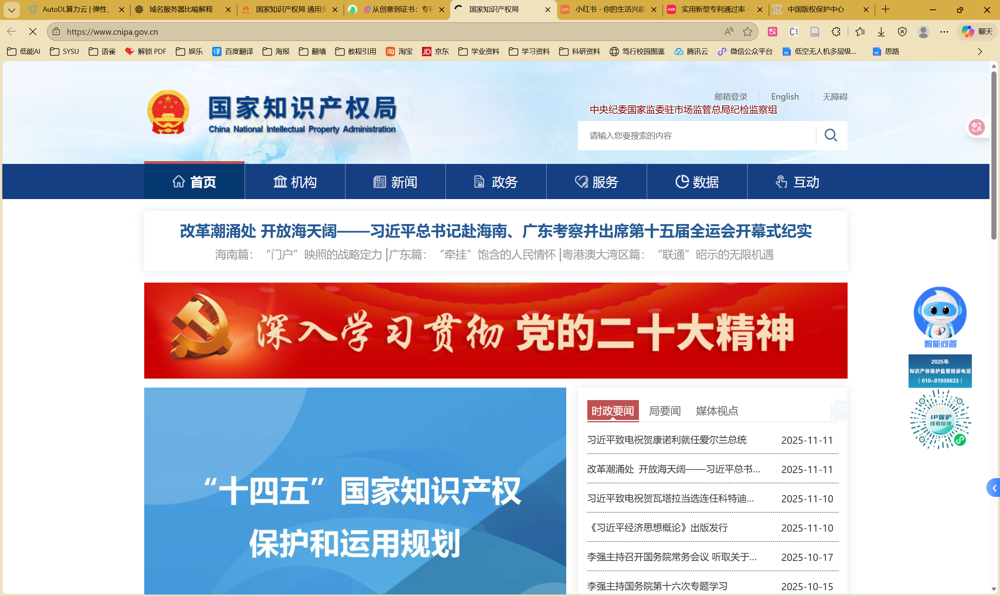

向下滑动，找到【政务服务】

<!-- 这是一张图片，ocr 内容为： -->
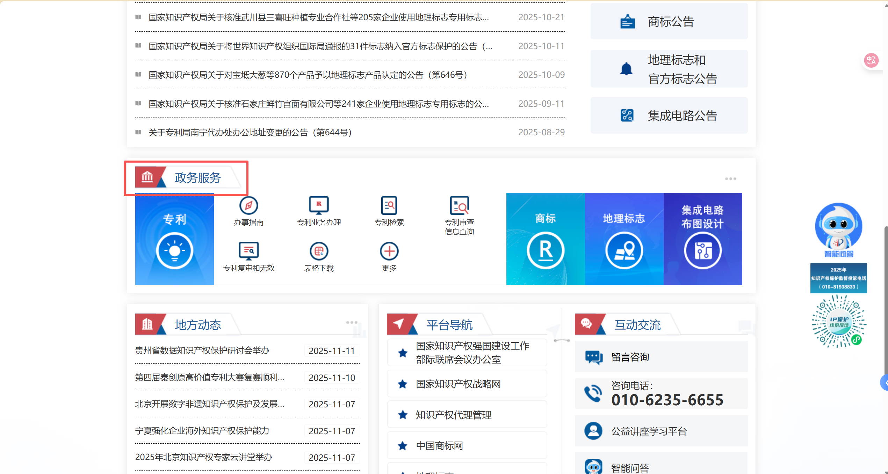

> **· 办事指南**：查看流程、材料清单、收费标准、办理时限与窗口说明
>
> **· 专利业务办理**：在线递交申请、请求实审、答复OA、分案/更正、转让与许可备案、缴费/年费等  
· 适用：已有账号/数字证书，需要正式线上办事
>
> **· 专利检索**：按关键词/申请号/申请人检索公开与公告的专利文献，查看摘要、权利要求、PDF  
· 适用：立项前的新颖性检索、写申请前找近似方案、竞品/技术跟踪
>
> **· 专利审查信息查询**：查询单个案件的进度与法律状态（受理、公开、实审、OA、授权/驳回、费用）
>
> **· 专利复审和无效**：对被驳回申请提起“复审”；对已授权专利提起“无效宣告”请求
>
> **· 表格下载**：下载请求书、著录项目变更、费用减缴请求、优先权文件清单、委托书等标准模板
>

点击【专利业务办理】，进入专利业务办理系统后，选择注册-自然人注册。

注册即可，因为其他诸如查询专利等功能，都需要登陆账号操作，所以要注册账号

<!-- 这是一张图片，ocr 内容为： -->
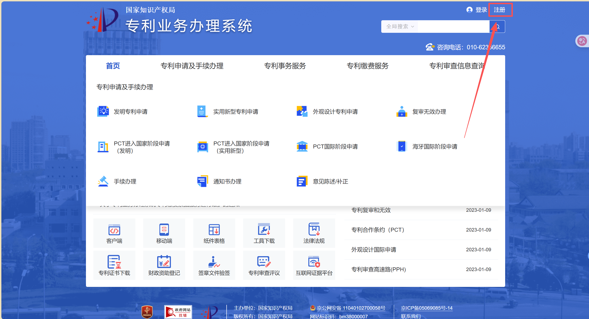

注册完成后，可以进入系统试一试，当然，发明专利建议找专业的代理机构。

<!-- 这是一张图片，ocr 内容为： -->
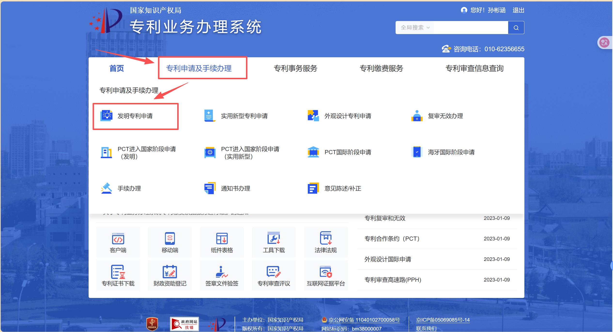

进入发明专利申请页面，点击新申请办理（只是试一试，发明专利建议找专业的代理机构）

<!-- 这是一张图片，ocr 内容为： -->
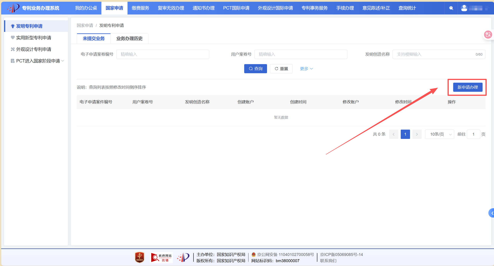

可以看到要提交的材料列表

<!-- 这是一张图片，ocr 内容为： -->
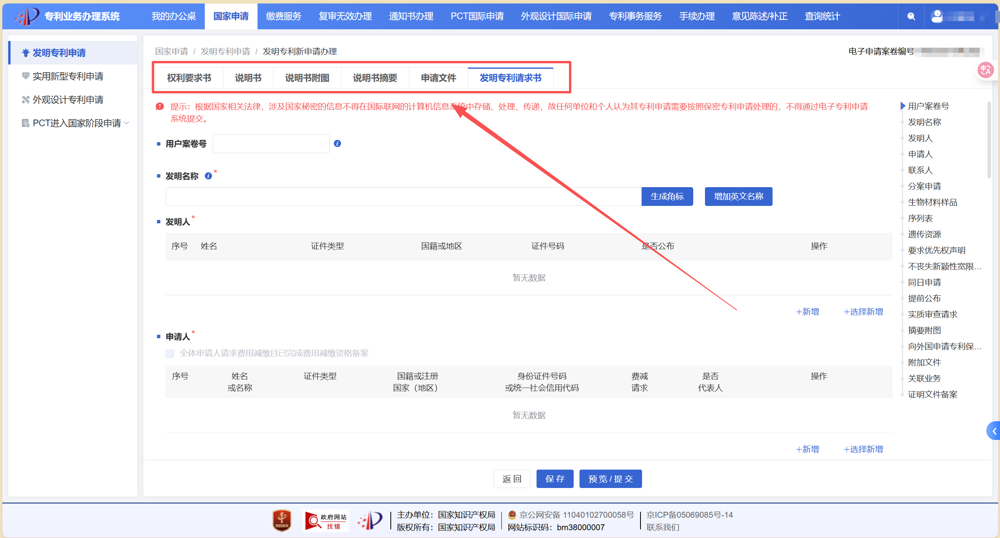

## （2）申请材料
根据官方文档，申请发明专利应当提交以下文件：《发明专利请求书》、《说明书摘要》、《权利要求书》、《说明书》，必要时还应当提交《说明书附图》  。

> 点击专利检索，就可以查看别人的发明专利申请材料，我们本次讲解以《一种基于深度学习的直肠癌医学影像病灶分割方法及装置》为例
>
> <!-- 这是一张图片，ocr 内容为： -->
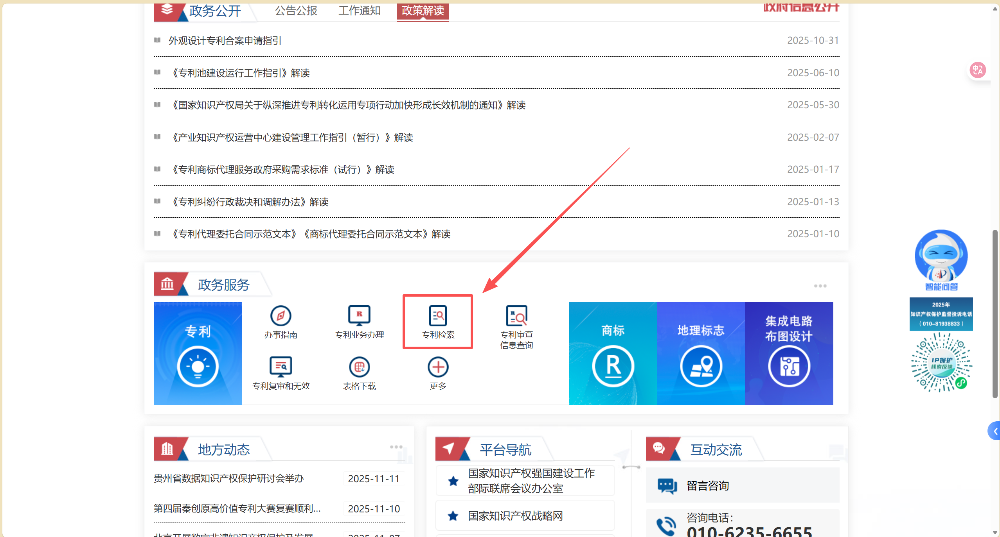
>

**· 《发明专利请求书》**  
**主要内容**：发明名称、发明人、申请人、联系人、代理/费用减缴、优先权主张、是否分案/PCT进入、附送文件目录等。  
信息必须与其它文件一致；勾选、列明随案提交的材料与清单。

<!-- 这是一张图片，ocr 内容为： -->
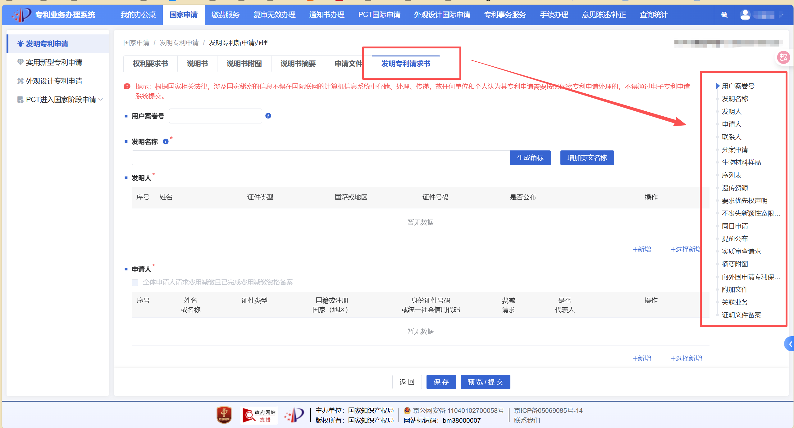

比较复杂，不建议了解。

**· 《说明书摘要》**  
是供公开与检索用的**300字左右**的简短概述（可附一幅“摘要附图”）。让公众快速了解发明要点，便于数据库检索。

<!-- 这是一张图片，ocr 内容为： -->
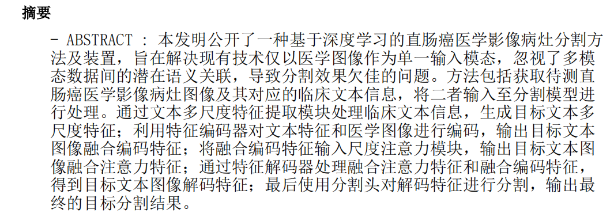

[CN202511106581_摘要.pdf](https://www.yuque.com/attachments/yuque/0/2025/pdf/50465133/1762940959133-9e304ff0-5888-4d3d-93f0-07eb3fdb9f57.pdf)

**· 《权利要求书》**  
**是**法律意义上**确定保护范围**的文件。发生侵权判定时以其为准。至少1项**独立权利要求**（产品/方法/用途等类别）＋若干**从属权利要求**（进一步限定技术特征）。

[CN202511106581_权力要求书.pdf](https://www.yuque.com/attachments/yuque/0/2025/pdf/50465133/1762940966445-caf5da21-65f3-4fa4-8c74-481231d5e053.pdf)

<!-- 这是一张图片，ocr 内容为： -->

> **AI分析一下，内容比较多，浏览即可。**
>
> 这组权利要求的结构完整：以**方法**为主权（权利要求1），通过若干从属项（2–6）细化关键模块与数据流，再以**训练方法**（7）、“**装置**”（8）和“**计算机设备/存储介质**”（9、10）对应覆盖软件部署与程序产品，构成“方法—装置—程序—介质”的全套保护链条。
>
> 就**独立权1**而言，技术方案的核心是“**影像+临床文本的多模态分割**”流水线：获取直肠癌病灶影像及其**对应临床文本**→经“**文本多尺度特征提取模块**”得到文本多尺度特征→与影像一起送入含**四级多模态特征提取与融合模块**的**特征编码器**→输出的多尺度融合特征再经**尺度注意力模块**重加权→进入**特征解码器**重建→经**分割头**产出病灶分割结果。权1使用“**包括**”表述（开放式用语），但同时**限定了若干必备要素**：必须同时使用临床文本信息；编码器被明指为“四个”层级；解码前须经历“尺度注意力模块”。这些限定共同刻画了“文本多尺度—多级图文融合—尺度注意力—解码分割”的主干思路。
>
> **从属权2–6**把实现细节逐层坐实，提供授权与稳定性的“备份层级”。权2把“文本多尺度特征”落到**文本编码器+多层感知机+状态空间模型**的并行多尺度管线；权3规定编码器的**分层下采样**与“第1至第4”级融合特征的生成路径；权4把首级融合模块细化为**视觉状态空间提取、多核空间注意力、3×3卷积、交叉注意力、MLP、通道注意力**的串并联组合并给出具体的数据流；权5进一步给出“视觉状态空间提取”的**标准化—全连接—深度可分离卷积—二维状态空间**序列；权6则将**尺度注意力与解码器的逐级上采样相加**关系说明清楚。整体看，这些从属项把“为什么能更好分割”的可实施性与技术效果支撑了起来。
>
> **权7**覆盖**训练流程**：含数据增强、将“分割结果+文本编码特征”代入**预置损失函数**反向更新、以“更新次数达阈值”判定收敛。该项可用于约束“仅训练他人模型”的行为，但实践维权取证难度较方法/装置更高，因此与权8–10配合更有现实效果。**权8**将方法模块化为**获取/输入/提取/编码/尺度/解码/分割**等功能模块的装置结构，便于覆盖**在端侧部署的整机或SDK**；**权9/10**是典型的**计算机设备/介质**项，确保对“可执行程序”和“模型权重+推理代码”的分发形成产品层面的保护闭环。
>
> 就**保护范围与可规避点**看，当前权1对**疾病对象**限定为“直肠癌”，对**编码器层级**限定为“四级”，对**是否必须引入临床文本**作了刚性要求。这些都是**潜在设计绕开路径**：例如改为“胃癌/宫颈癌”等其他部位，或仍做图文多模态但把编码器改成“三/五级”，或仅用影像不引入临床文本，均可能避开权1；不过若竞争方案虽改动层数但在功能—方式—效果上与“四级多模态融合”实质等同，仍可能触及**等同侵权**的判断空间。相应地，本案已通过从属项把**文本状态空间建模、多核空间注意力、交叉注意力、通道注意力**等“关键算子组合”写实，为出现“只改层数不改机理”的方案准备了更窄而稳的落脚点。
>
> 综上，这套权利要求以“文本引导的多尺度图文融合+尺度注意力重加权”为发明要点，方法—装置—程序—介质覆盖较全，**授权逻辑扎实**。若后续还要增强抗规避能力，可考虑在继续分案/后续申请中：将疾病对象从“直肠癌”推广为“消化道肿瘤/实体瘤/医学影像病灶”，将“四个模块”表述为“至少两个/若干层级”，并对“尺度注意力”的实现泛化为“通道或空间注意力及其组合”，形成“广—专—窄”多圈层布局。
>

**· ****《说明书》**  
**是**对发明作**充分公开**与技术支撑的正文。包括①技术领域 ②背景技术 ③发明内容（要解决的问题、技术方案、**有益效果**）④附图说明 ⑤具体实施方式（实施例、步骤/结构、参数、实验或效果数据）。让本领域技术人员**能够实现**该发明，并为权利要求提供依据。  
[CN202511106581_说明书.pdf](https://www.yuque.com/attachments/yuque/0/2025/pdf/50465133/1762940978618-b45f17b2-62f8-438e-a674-63b34cfb7b60.pdf)

<!-- 这是一张图片，ocr 内容为： -->
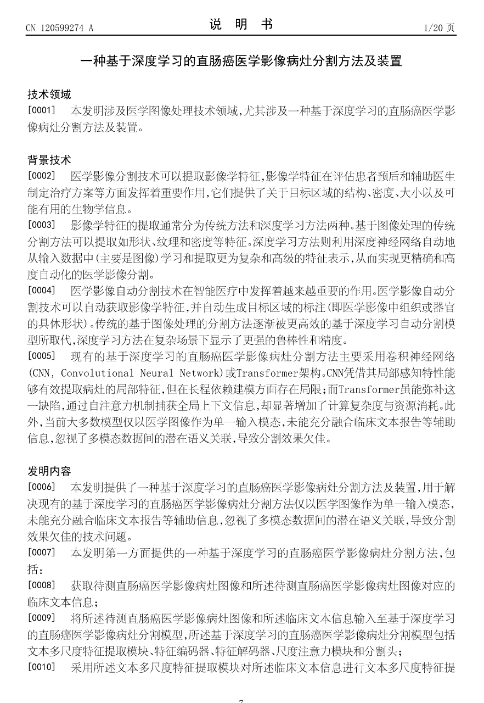

请大家自行浏览。

**· 《说明书附图》（可选）**  
配合说明书的图纸/流程图/结构示意等。帮助理解技术方案，作为公开内容的一部分；摘要可择其一作为“摘要附图”。要能体现关键部件与步骤，标注一致的附图标记；线稿黑白、清晰可读；当文字难以充分表达时**应当提交**。

[CN202511106581_说明书附图.pdf](https://www.yuque.com/attachments/yuque/0/2025/pdf/50465133/1762940986486-401a6cd7-bf3c-4a5b-a8a8-30bf26417481.pdf)

## （3）申请流程
<!-- 这是一张图片，ocr 内容为： -->
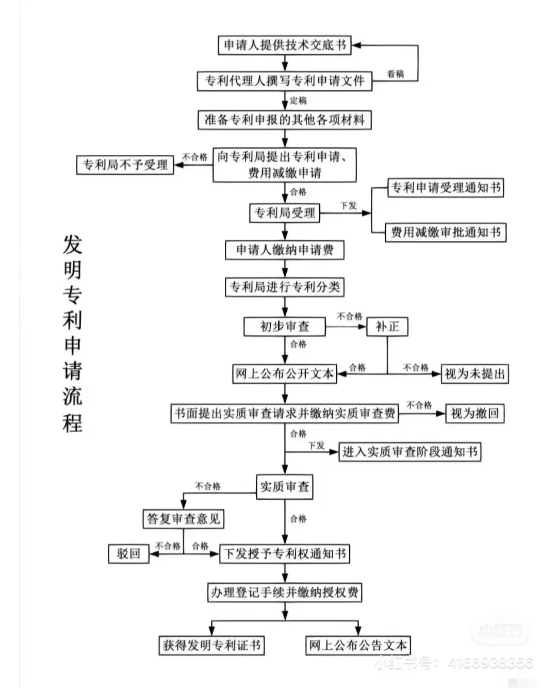

为什么要分为初步审查和实质审查？

+ **初步审查（形式/程序）**：查**有没有、对不对**——文件是否齐全、格式是否合规、信息是否一致、分类是否正确、是否属于可授予客体；不合格→补正或视为撤回。
+ **实质审查（专利性）**：查**值不值得授予**——检索对比文献，判断新颖性/创造性/实用性，考察说明书是否充分公开、权利要求是否清楚并有据可依；往复答复直至授权或驳回。

把审查拆成**初步审查**和**实质审查**，本质是把“材料是否合格”和“技术是否值得授予”两件事分开做。先用初步审查把低成本的问题一次清掉：材料是否齐全、格式是否规范、图文是否一致、权利人信息是否准确、是否属于可授予的客体、如何分类与公开等。只有这些都达标，文档才能被公开、被检索，也避免把不合格案件带入后续环节浪费资源。等程序面干净了，再进入实质审查，审查员才投入大量检索与比对，围绕新颖性、创造性、实用性以及说明书支撑、权利要求清楚等实体标准做“值不值得给证”的判断。

<!-- 这是一张图片，ocr 内容为： -->
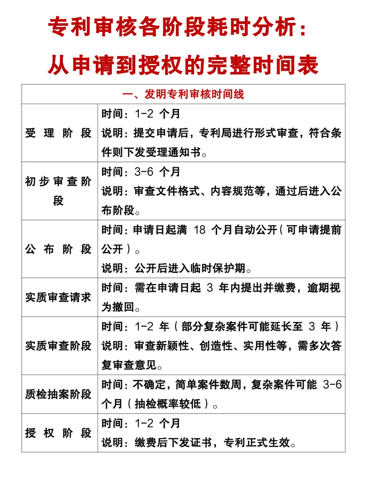

## （4）专利交底书
交底书是**给代理人公司看的技术说明底稿**，不是直接提交给国知局的文件，关键技术可以直接告诉专利公司不必担心。目的是把**技术问题→核心方案→可实施细节→效果证据**讲清楚，便于撰写《说明书》《权利要求书》，并提前确定**保护边界与布局策略**。

[专利交底书模板.docx](https://www.yuque.com/attachments/yuque/0/2025/docx/50465133/1762946519602-51ed7a39-97a8-40be-9b05-69fa0c00b7e0.docx)

大家也可以参考模板，先行进行了解。

> 交底书模板中所含有公司均不是ISEGeekUp团队推荐、保证，仅参考内容即可。
>

---

# 3、实用新型专利
## （1）申请材料
根据官方文档，申请**实用新型专利**应当提交以下文件：《实用新型专利请求书》《说明书摘要》《权利要求书》《说明书》《说明书附图》  

[CN202423173373_FullTextImage.pdf](https://www.yuque.com/attachments/yuque/0/2025/pdf/50465133/1762949352504-42b20c6d-fd58-4801-a709-eb73fc0faf63.pdf)

<!-- 这是一张图片，ocr 内容为： -->
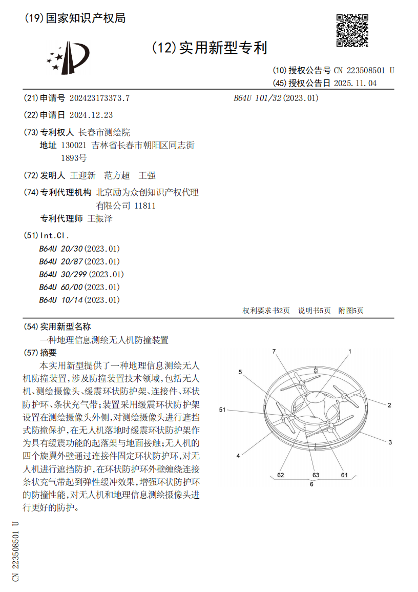

可以参考长沙市测绘院《一种地理信息测绘无人机防撞装置》实用新型专利材料进行了解

## （2）申请流程
☑ 资料提交国知局（1天）  
一般采用电子提交方式。专利申请人或代理人完成相关手续后，即可向国知局提交电子申请资料。

☑ 国知局受理资料（3-5个工作日）  
在将实用新型专利申请资料提交给国知局后，3-5个工作日内，国知局会下发受理通知书。

<!-- 这是一张图片，ocr 内容为： -->
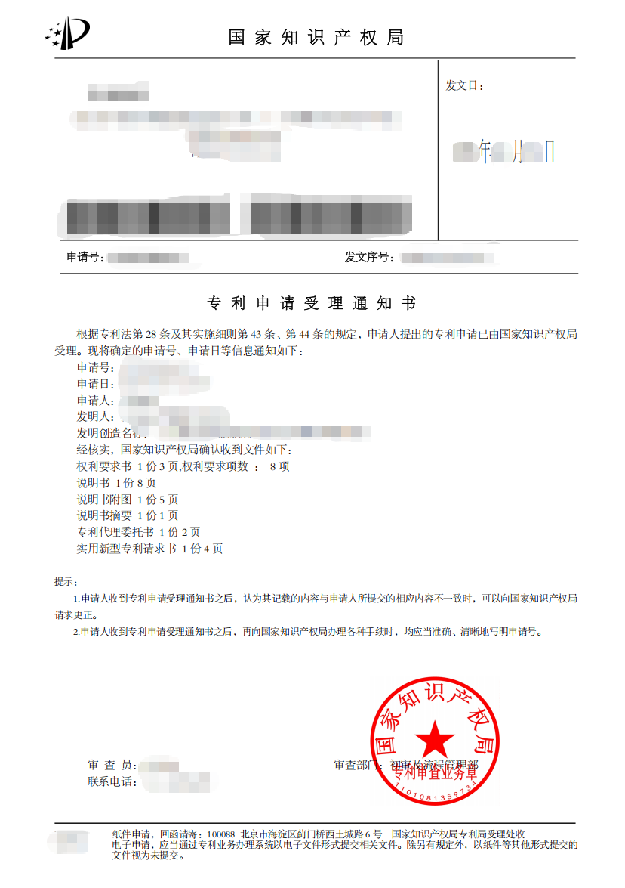

☑ 初审（3个月左右）  
从申请日起算约3个月，实用新型专利审查合格后下发初审合格通知书，进入下一阶段；若审查不合格，则下发补正或者审查意见通知书等。

☑ 授权（3-6个月）  
经过3-6个月时间，初审合格即可授权。

☑ 续费/登记（授权通知日起2个月内）  
收到授权通知后2个月内，需缴纳授权官费，办理登记手续。

PS：实用新型专利申请授权周期一般是6-12个月左右。

## （3）专利交底书
**实用新型专利交底书**在模板主体不变的基础上，**突出结构、部件、连接关系、尺寸配合**；少写算法，多写**机械/电气结构**与**装配步骤**等。  

---

# 4、外观设计专利
## （1）申请材料
根据官方文档，申请**外观专利**应当提交以下文件： **《外观设计专利请求书》、《外观设计图片或照片》、《外观设计简要说明》  **  
重点放在**产品名称、用途、设计要点、立体/六视图、关键局部放大。**

[CN202530471307_FullTextImage.pdf](https://www.yuque.com/attachments/yuque/0/2025/pdf/50465133/1762949964245-d38c4838-3c08-4cb9-a1d5-5a7157de19d9.pdf)

<!-- 这是一张图片，ocr 内容为： -->
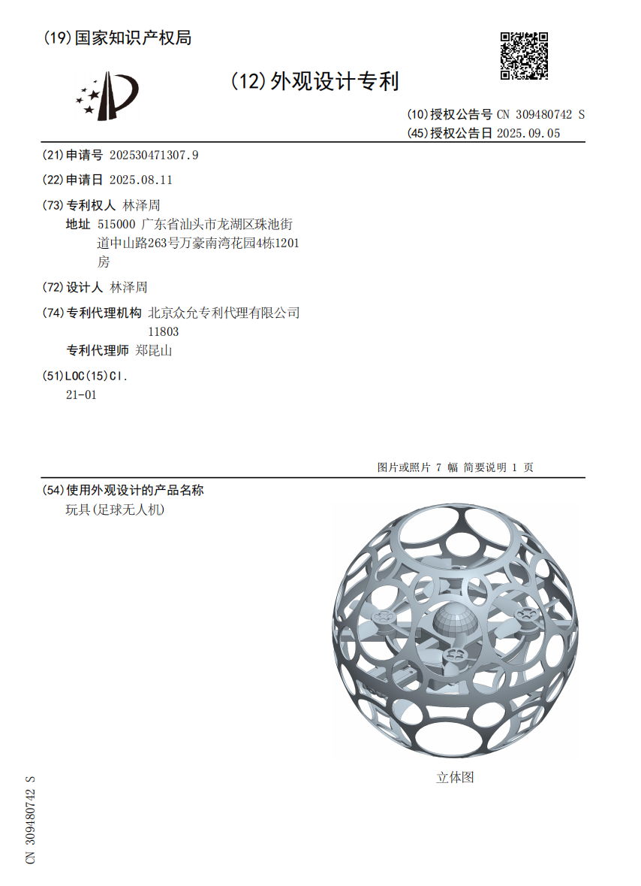

可以参考《足球无人机》外观设计专利材料进行了解

## （2）申请流程
☑ **资料提交国知局（1天）**  
一般采用电子提交方式。专利申请人或代理人完成相关手续后，即可向国知局提交电子申请资料。

☑ **国知局受理（约1–2天）**  
将专利申请文件提交给专利机构，机构进行受理与形式核对，检查申请文件的完整性与符合性。

☑ **初步审查（约2–5个月）**  
进入初步审查阶段，审查员会就申请文件中的形式问题发出**补正通知书**；申请人按要求进行补正并回交。

☑ **授权（约1个月）**  
初步审查合格后，审查员下发**授予专利权通知书**。

☑ **领证（授权通知日起2个月内）**  
收到授权通知后2个月内需**缴纳授权官费并办理登记**；完成后取得**外观设计专利证书**，专利权正式确认。

---

# 5、软件著作权
先进入[中国版权保护中心](https://www.ccopyright.com.cn/)，点击**注册，**注册账号。

<!-- 这是一张图片，ocr 内容为： -->
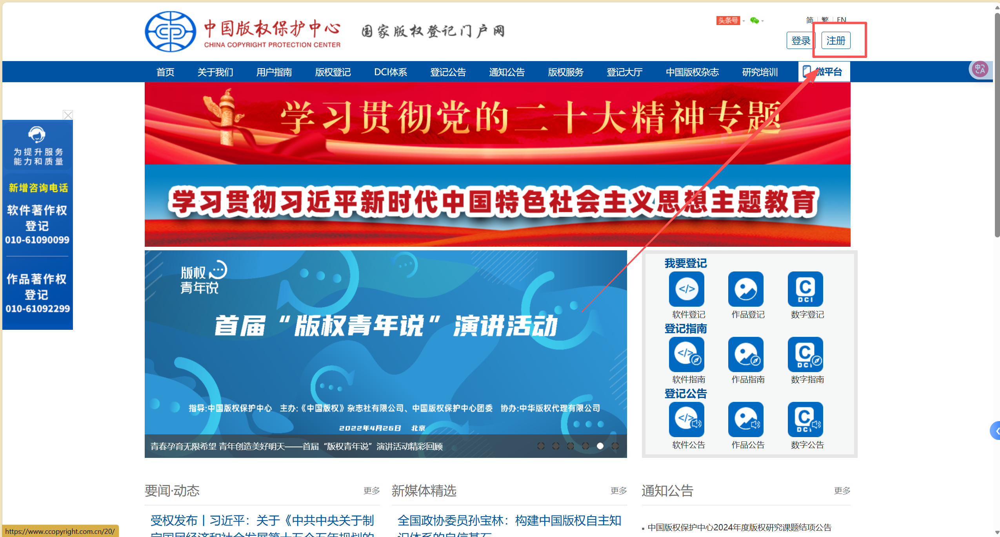

注册完后，点击**软件登记**，然后点击任意一个申请项目，都会跳转到实名认证。

实名认证需要3天，请稍作等待。

<!-- 这是一张图片，ocr 内容为： -->
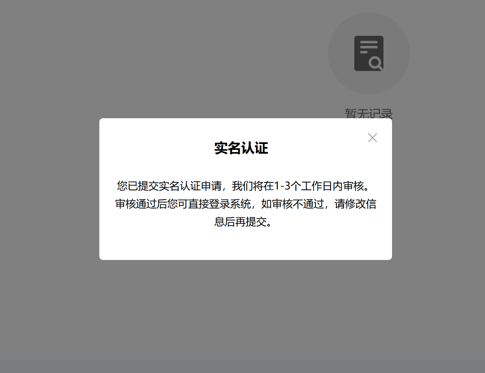

认证完毕后，选择**软件登记**

<!-- 这是一张图片，ocr 内容为： -->

选择**R11计算机软件著作权登记申请**

<!-- 这是一张图片，ocr 内容为： -->
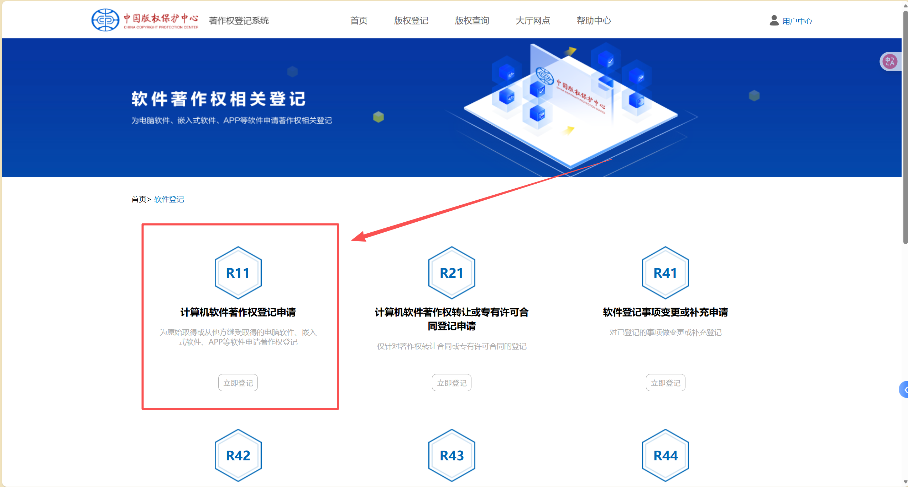

选择**我是申请人**

<!-- 这是一张图片，ocr 内容为： -->
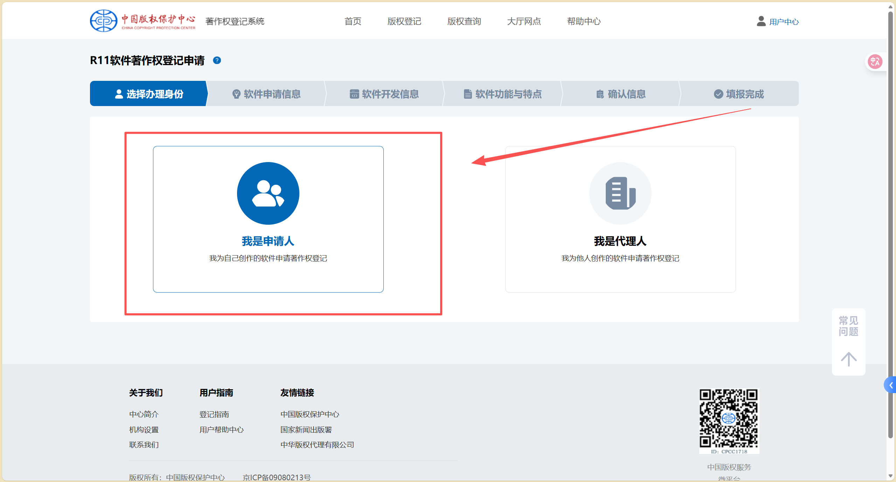

填写软件申请信息、软件开发信息、软件功能特点

<!-- 这是一张图片，ocr 内容为： -->
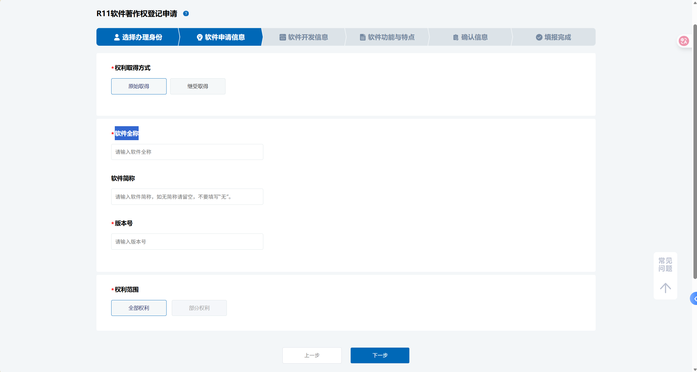

## （1）申请材料
根据官方文档，申请软件著作权应当提交以下文件：《代码文档》《操作手册》，还应当准备填写到网站里的申请信息。

填写到网站里的信息主要包括：[申请信息模板.docx](https://www.yuque.com/attachments/yuque/0/2025/docx/50465133/1762952516121-a3549ad1-e629-456f-84ca-c44d906b7e09.docx)

《代码文档》要提交代码前30页与后30页，共60页，如果不足60页就全部提交，每页放置50行代码

> ①如果源代码总量多于3000行，需要提交连续的前1500行和后1500行
>
> ②如果源代码总量少于3000行，需要提供全部源代码 ；
>
> ③代码粘贴在文档内，应提交自己独立开发的代码，不能复制别人；源代码最后一页应是一个完整模块结尾。提交代码语言应与采集表一致。
>

《操作手册》主要包括以下内容：

<!-- 这是一张图片，ocr 内容为： -->
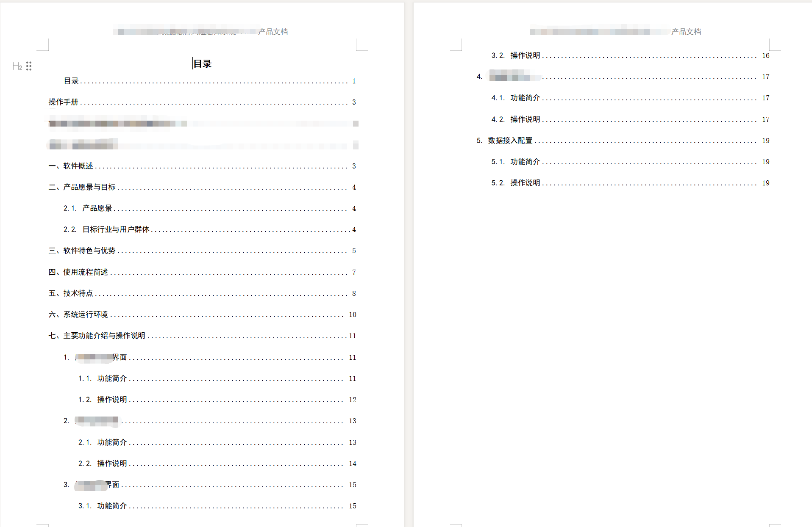

> ①操作说明书应详细介绍该软件的功能（主界面的功能模块都要介绍）。必须含有登陆界面、主界面、操作界面的截图（截图要连贯、完整、图中文字要清晰可辨）及有关操作步骤和功能的文字说明，体现出具体的功能按钮，各个界面是如何跳转的，从软件登陆、主界面到各个功能模块的使用；
>
> ②界面截图中出现的软件名称要与申请表中软件名称完全一致，图要有图注，并在文中相应的位置给出，例如：图1是什么模块；
>
> ③应截取软件运行界面的全图，包括但不限于窗口上方软件名称部分及可能的关闭窗口，侧面或者上面的菜单栏等，不能只截取部分。如需表示界面上某个区域，应全面截图后用红色框在截图上标记出来；
>
> 移动端：截图显示的界面，要与采集表中的软硬件环境一致（如安卓与苹果系统）。截图显示应包括顶部信号栏及底部功能按键等。
>
> ④保证打印后的操作说明书应清晰显示截图中的文字（尤其是版权声明及ICP备案号）。
>

如果是多人开发还要提交《多人合作合同》

[多人合作开发协议书.doc](https://www.yuque.com/attachments/yuque/0/2025/doc/50465133/1762952154121-501c55be-6c86-404b-b1da-9ce1870f503b.doc)

<!-- 这是一张图片，ocr 内容为： -->
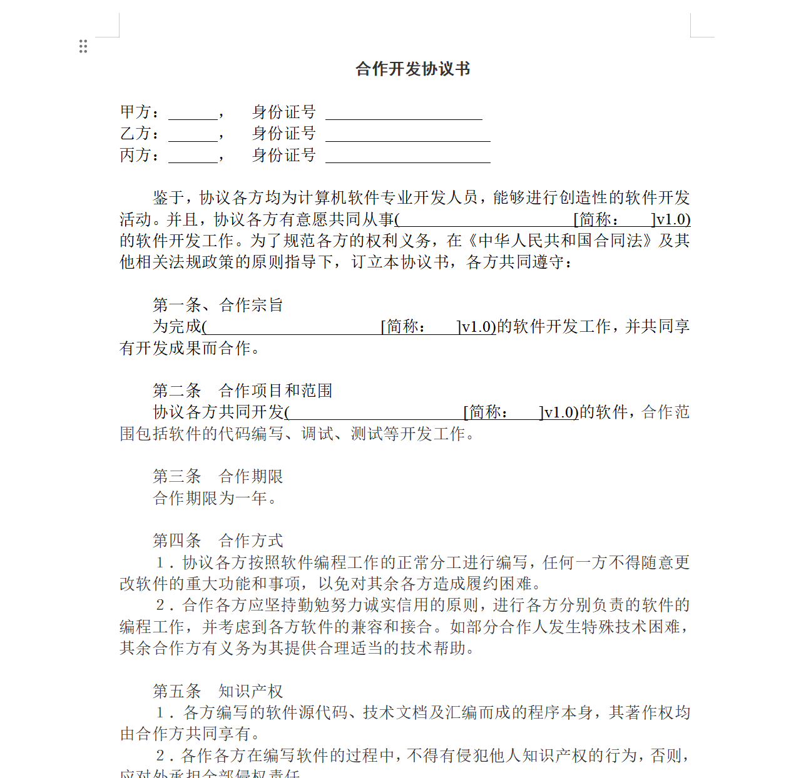

## （2）申请流程
☑实名认证：1~3天。如果是共同开发，请其他开发人同步实名，要不然无法在平台上添加

☑软著提交：1天内 。如果是共同开发，提交时需要其他开发人接收验证码

☑软著受理：10-20天左右 

☑软著审查：30-40天左右 

☑领取证书：显示“待发放”后当天或次日即可下载证书

---

# 中山大学专利发表流程
**如果需要走学校报销，必须走学校的专利发表流程**

在提交国家知识产权局专利申请前，需按照学校管理规定，完成内部申请提案流程，确保专利归属、权利分配、申请主体等信息明确。

1、科研人员通过“科研管理协同创新服务平台”进入“专利提案申请”板块。（**学生无法进入该平台，只有老师才有权限进入**）

2、点击“专利提案申请”，完善专利基本信息，上传相应附件，点击提交发送院系审核。   

3、院系科研秘书进行审核，审核通过点击提交至知识产权管理员，不通过则退回科研人员。

4、科研人员确认科管系统审核通过后，携带专利负责人签字的委托代理合同等赋码材料前往科研院横向处（南校园中山楼101办公室）办理盖章。

5、科研人员将签订好的合同及有关附件电子版上传提交科管系统“盖章文件”，完成专利申请阶段审批后，可打印凭证，完成财务报销。

<!-- 这是一张图片，ocr 内容为： -->
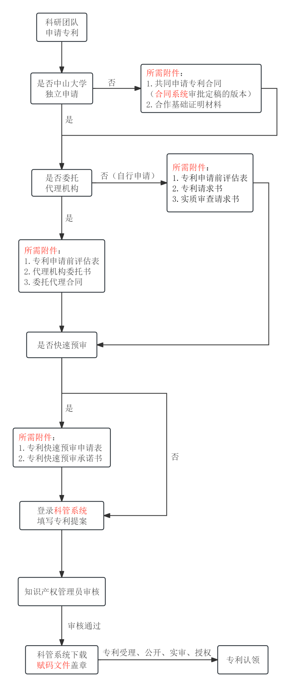

[知识产权宣传月 | 破解申请难题：知识产权实务指南](https://mp.weixin.qq.com/s/lxqF0rpTIgmCMuZYBaTYJA)

欢迎同学搜索【中大科研】公众号阅读原文

---

# 专利代理的核心工作是什么？
评估创新、撰写材料、流程申报

1. 检索创新性报告：新颖性、创造性、实用性评估。
2. 撰写与布局：专利权利要求书、说明书、附图。
3. 流程代理：提交、实审请求、无效应对、授权/年费管理。

**软著代理的核心工作是什么？****材料规范、合规检查、申报与补正**

1. 材料规范：版本号与权属证明；源代码节选（通常“前30页+后30页”且连续、可编译片段）、技术文档（功能/模块/流程图/接口/运行环境/界面截图）。
2. 合规检查：避免侵权与证据链断裂。
3. 申报与补正：在线填报、文件格式校验、补正说明、加急办理（如需）。

**何时宜用代理？**

+ **强烈建议（专利）：发明或核心实用新型、涉及算法+装置/医疗器械/嵌入式组合权利要求。**
+ **自行办理（软件著作权）：软件著作需求明确、代码与文档齐全、时间宽裕。**

**哪里可以找找到代理？**

可以询问老师学校官方代理，或者购物平台。但请注意甄别。

---

谢谢同学阅读到这里！

SYSUISEGeekUp团队

2025.11.13

