🪄教程编号：轻坊实践·第1期

🎯教程目标：带你从**买域名—DNS 解析—邮箱转发**完整走一遍，最终实现用自己的**专属域名**稳定收发邮件

> **域名**：域名是做什么的？ 把互联网想成一座巨大的城市。域名就是你店门口那块好记的**招牌**，别人要靠招牌来识别找到你的店。**一级域名** _**sysu.edu.cn**_** **就像是你的品牌名，而**二级域名** _**ise.sysu.edu.cn**_ 就像是开的分店名。  
>
> **DNS(****D**omain **N**ame **S**ystem,域名系统**) 解析**：为什么需要**DNS解析**？可以想象成导航，我们在导航软件中看到的是**2D地图**，但是机器只能理解**坐标**，所以确定要去中山大学(深圳校区)工学园后，就要**先把名字转化成她的坐标**，再**规划路线**。同样每个网站背后都有**服务器**，它也有自己的**IP地址(****I**nternet **P**rotocol **A**ddress,网际协议地址，是一串数字，比如202.116.64.8**)**。我们要访问_**sysu.edu.cn**_，实则是机器先将**域名转化为IP**(比如202.116.64.8)，这样就可以成功访问了。DNS解析就是把**域名和IP关联起来**。
>
> <!-- 这是一张图片，ocr 内容为： -->
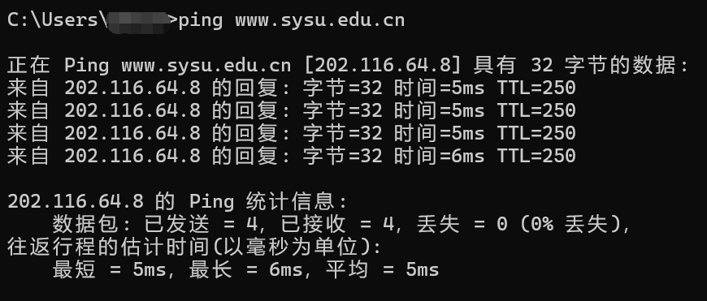
>
> **邮箱转发**：为什么要有**邮箱转发**？ 把域名邮箱想成一家公司，你对外公布_** ISEGeekup@ise.sysu.edu.cn**_ 这个地址，但真正每天看的可能是你的_ __**ISEGeekup@mail2.sysu.edu.cn**_企业邮箱。**邮箱转发服务**就像请了个专业前台，凡是寄到 _ __**ISEGeekup@ise.sysu.edu.cn**_** **的信，前台先接收，再**按你的规则转发**到你的常用收件箱。这样既**统一品牌形象**（对外都是@你的域名），又**省去自建邮件服务器**的维护成本。  
>

📚教程关联课程：《计算机网络》

✍️教程字数：3600字

💻依托平台：语雀(教程撰写)、腾讯云(域名购买)、腾讯企业邮(邮箱配置)

💴预计实操成本：14元

| 内容 | 成本 | 备注 |
| :---: | :---: | :---: |
| 域名注册 | 14元 | .top域名注册一年 |
| 总计 | 14元 | |

⏱️预计实操时间：60分钟。

| 内容 | 时间 | 备注 |
| :---: | :---: | :---: |
| 注册腾讯云账号 | 15分钟 | 包括个人实名认证时间 |
| 域名购买 | 25分钟 | 包括等待审核时间 |
| 配置专属邮箱 | 20分钟 | - |
| 总计 | 60分钟 | |

> 阅前须知： 本篇教程所提及的软件、网站与平台仅为推荐，供参考与学习使用；如同学权益受到侵害，请立即停止使用并与我们联系。ISEGeekup 团队不对教程中第三方服务的可用性、合规性、稳定性与安全性作出任何明示或暗示的保证，亦不承担因使用或信赖其产生的任何直接、间接或附带损失与责任；请在遵守相关国家法律法规与学校制度的前提下自行甄别风险、妥善保护个人信息并做好数据备份。
>

---

# 1、注册腾讯云账号
> **腾讯云：**作为腾讯旗下的云计算平台，整合计算、存储、网络、安全、数据库与 AI 等核心能力，注册账号后就可以方便的在网站中注册域名（当然还有其他平台可以注册域名）。  
>
> **服务器：服务器是什么？**每一个网站提供的服务都不是凭空出现的，必然有代码逻辑支撑，是要有计算、存储等等组件存在的，而计算、存储等等这不正是一台电脑可以实现的功能！没错，服务器就是一台24小时开机的电脑，时时刻刻准备着应对用户的请求。
>

进入腾讯云[腾讯云 - 产业智变 云启未来](https://cloud.tencent.com/)（←这就是链接），点击右上角**免费注册**。

> 我们这里使用腾讯云是因为后续要使用企业邮箱配置，两者同为腾讯旗下，可以自动配置比较方便。
>
> 当然，域名购买阿里云、华为云等等平台都可以，文中以腾讯云为例。
>

<!-- 这是一张图片，ocr 内容为： -->
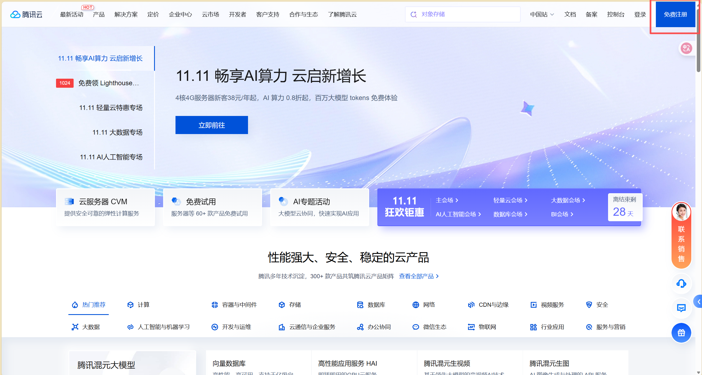

个人用户建议选择【微信扫码注册】，如下图：

<!-- 这是一张图片，ocr 内容为： -->
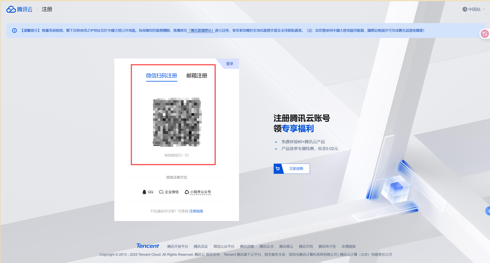

个人腾讯云账号选择**微信快速扫码**注册后，会弹出**实名认证**按钮，根据提示即可通过实名认证。个人实名认证支持微信扫码、QQ扫码和人脸识别多种方式，使用已经通过实名认证的微信账户注册并实名，几秒钟即可认证成功。

---

# 2、域名购买
> 既然是打造专属域名邮箱，那必然是先要拥有专属域名。
>

进入腾讯云首页[腾讯云 - 产业智变 云启未来](https://cloud.tencent.com/)，此时应该是已经登陆账号的状态，点击右上角**控制台**。

<!-- 这是一张图片，ocr 内容为： -->
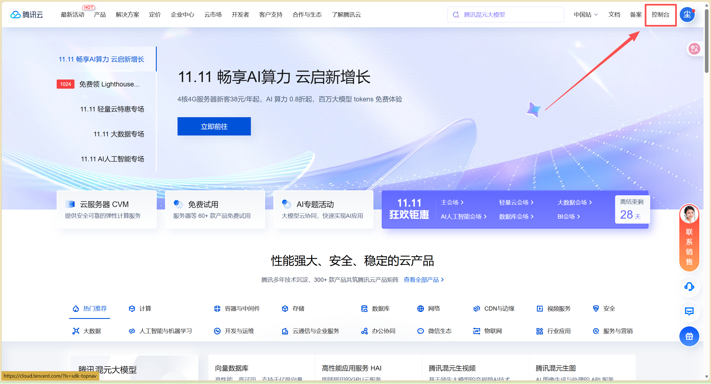

>  最早的**控制台**（Console）不是网页，也不是黑框框，而是**放在计算机旁边的一张“操作台”**：上面有一排排指示灯、开关、后来又接上键盘和打印机。工程师**在这张台子上开关机、查看状态、输入指令**，像飞机的驾驶台，所以叫“控制台”。  
后来计算机变小、连上网络，“控制台”这个词**逐渐指代一切“用来操控系统的入口”**：可以是命令行窗口，也可以是今天常见的**网页里的管理页面**。  
>

<!-- 这是一张图片，ocr 内容为： -->
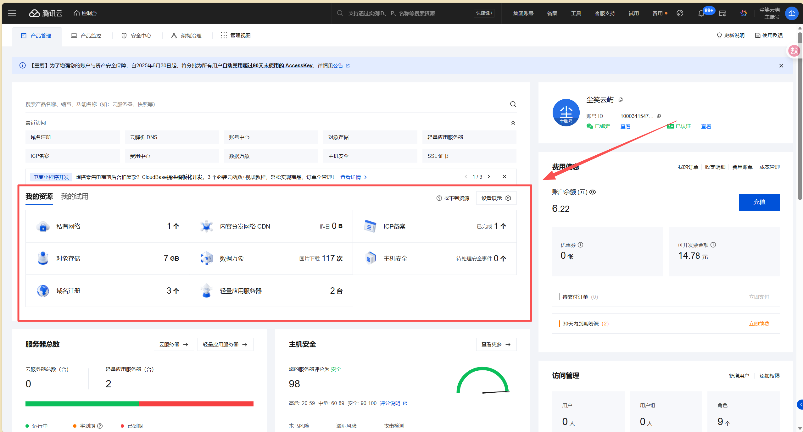

在搜索框中搜索**域名注册**，进入**域名注册**。

<!-- 这是一张图片，ocr 内容为： -->
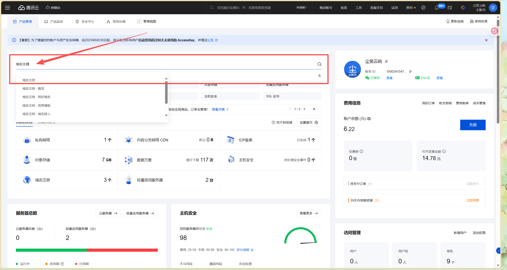

按照国家规定要求，要对域名持有者进行更详细的信息填写。选择**信息模板**-**新建模板**。

<!-- 这是一张图片，ocr 内容为： -->
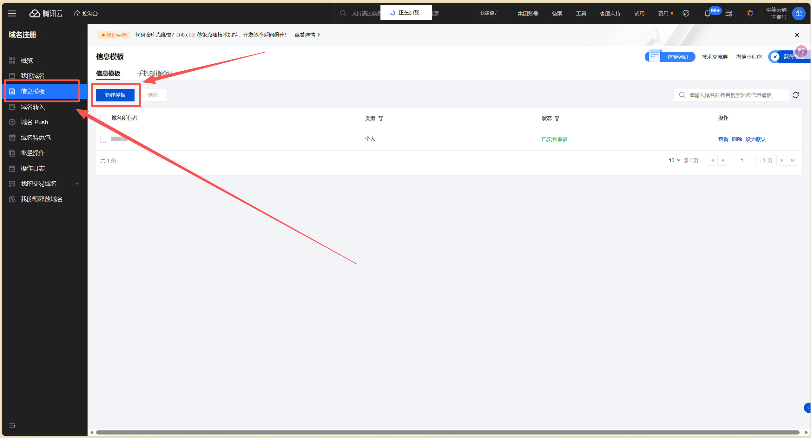

要填写的信息大致如下，包含**身份证图片**、**证件号码**(自动识别)、**中文名**(自动识别)、**联系人**、**地区**、**通信地址、邮箱**、**电子邮件**(注册时的)、**手机**(注册时的)：

<!-- 这是一张图片，ocr 内容为： -->
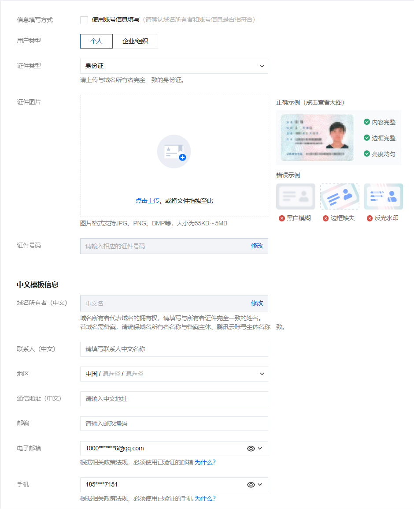

大概需要等待20分钟……

信息通过后，点击**我的域名**-**立即注册域名**。

<!-- 这是一张图片，ocr 内容为： -->
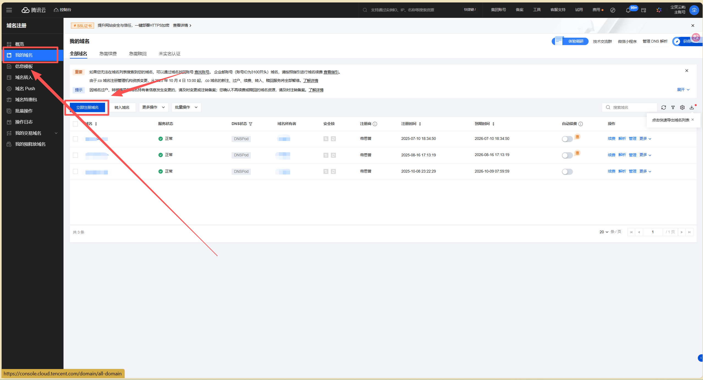随便选一个后缀(比如.com)，在搜索框输入你想注册的域名，点击查询。下面会蹦出更多便宜的后缀。推荐购买.top，因为第一比较好听，第二比较便宜。

>  .com、.cn、.top 这些都是顶级域名（TLD,Top Level Domain）。域名整体像“省/市/街道/门牌号”，而 TLD 就是“省份名”。全球有个管理局叫 ICANN 负责总体协调；每个后缀都有自己的运营商**注册局（Registry）** 管理；你在阿里云/腾讯云/Cloudflare 这类**注册商（Registrar）**下单，他们去向注册局登记。  
>

<!-- 这是一张图片，ocr 内容为： -->
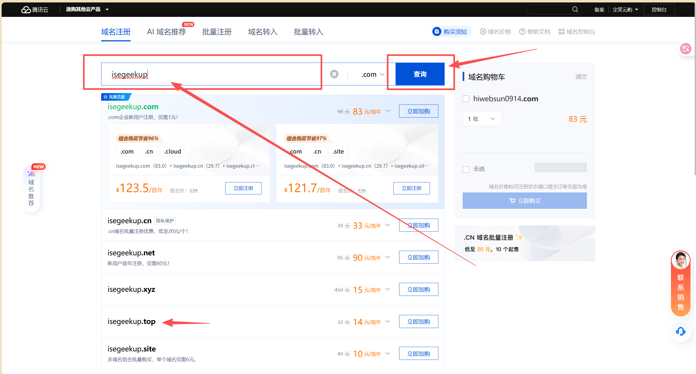

点击立即加购，发现右侧域名购物车出现商品。

同时还会发现一些可以组合购得商品，比如轻量应用服务器、DNS解析、SSL证书，个人使用都没必要买。

> 轻量应用服务器＝一台放在云上的“24 小时后厨”。只有当你要自己做网站、接口，或折腾自建邮件服务器时才需要它；你现在做“域名邮箱＋转发”，只是把门牌挂好、把信件转寄，增加几条 DNS 解析记录就行，不必租后厨。
>
> DNS 专业版＝更聪明的“路牌系统”（能按地区分流、做健康检查）。个人的小流量用免费 DNS 就够稳定好用；只有在访问量很大、要全局分流或有合同级可用性要求时，才考虑专业版。
>
> SSL(**S**ecure **S**ockets** L**ayer,安全套接字层) 证书（HTTPS 小锁<!-- 这是一张图片，ocr 内容为： -->
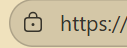）＝“密封信封＋门口保安”。它既把数据加密成密封信（别人路上看不懂），又让浏览器核验网站身份（别走进假店）。**自己对外建站时必须有证书**；只做邮箱转发则不用买。但现在很多平台都提供免费的SSL证书，所以建站也不需要额外购买。
>

<!-- 这是一张图片，ocr 内容为： -->
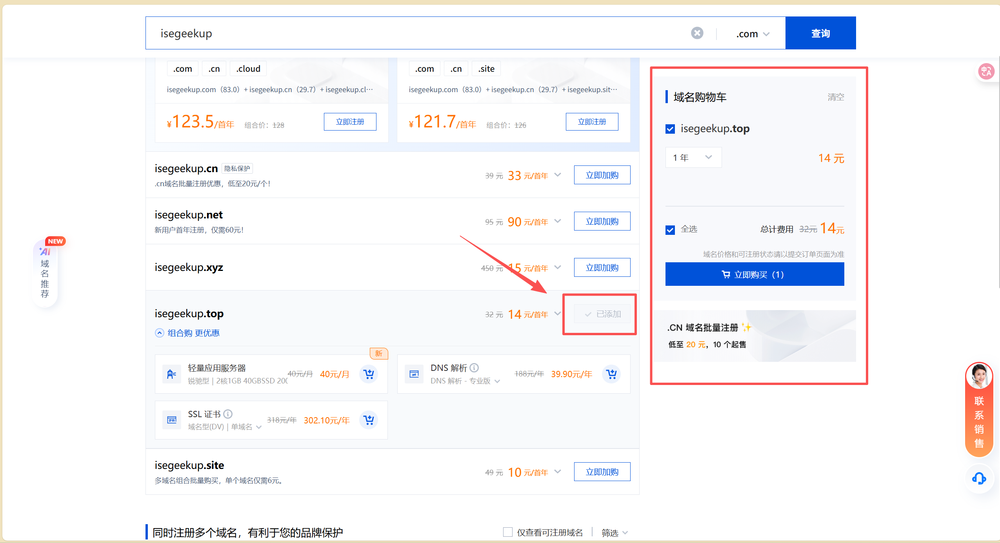

点击立即购买并且付费后，就可以等待1分钟左右，域名就可以正常使用了。

<!-- 这是一张图片，ocr 内容为： -->
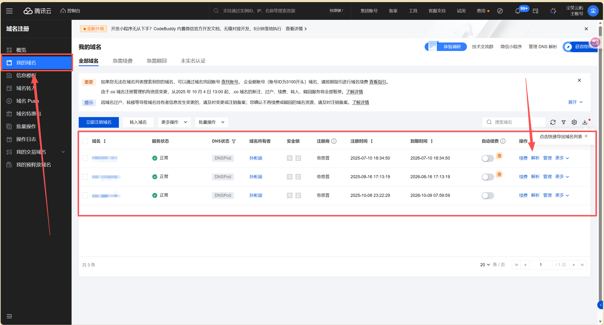

> 以下为拓展知识，蛮有意思的所以决定加上，可略过继续查看后续教程。
>
> 如上图，选择一个域名点击解析就可以进入DNS解析管理页面。
>
> <!-- 这是一张图片，ocr 内容为： -->
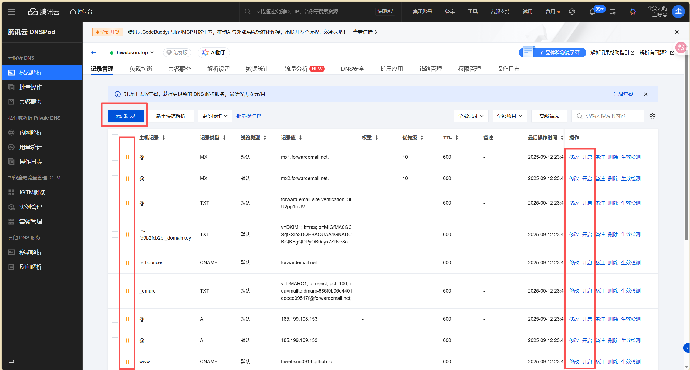
>
> 可以点击**添加记录**来增加新的解析记录。。**添加记录**这一步相当于**在你的域名名下增添一块路牌或贴一张说明**，告诉全网“这个名字要去哪里”“邮件往哪投”“怎么验证这是我家”等。点“添加记录”，其实就是往你的域名配置里写一行规则，浏览器、邮件系统、验证服务都会按这行规则行事。  
>
> 每条记录中主要包含主机记录、记录类型、记录值、权重、优先级、TTL。不知道大家是否好奇这些东西都是干什么的？
>
> <!-- 这是一张图片，ocr 内容为： -->

>
> **主机记录＝门牌前缀**  
写明“哪一扇门”，这样在后面的内容可以填写这个门后面指向什么。`@` 是**大门**（根域，example.com），`www` 是**分店门牌**（www.example.com），`mail` 是**邮箱专用**（mail.example.com）`*` 是**通配钥匙**（没单独设的都走它）。规定了不同的网址来访问的都是去往那个服务器，可以指向不同的服务器。
>
> 也就是说，一个一级域名下其实可以配很多二级域名，这个地方就是用来写二级域名前缀的，后面的信息就可以指向二级域名背后的服务器。当然如果是`@`就是指向一级域名背后的服务器。
>
> <!-- 这是一张图片，ocr 内容为： -->
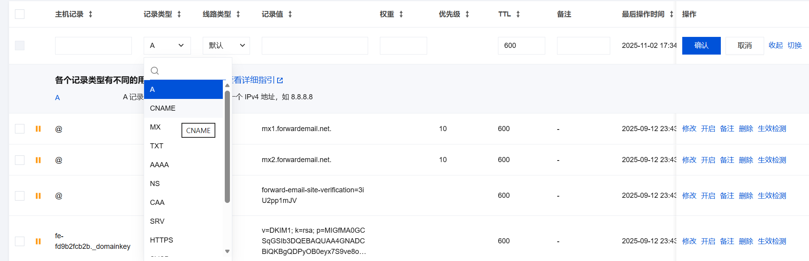
>
> **记录类型＝路牌的“种类”****  **
>
> + **A / AAAA（把域名解析到 IP）**：把主机名映射到服务器地址：A=IPv4，AAAA=IPv6。用于“这个名字，就在这台机器上”。示例：`IPv4地址：203.0.113.10 TTL 600`，`IPv6地址：2001:db8::10`。
> + **CNAME（把本域名指向另一个域名）：**最终目标仍是另一个主机名（再由它解析到 IP）。填写的是另一个网址，相当于跳转。
> + **MX（邮件交换记录，指明接收该域邮件的服务器） **MX 就是“收件前台”的路牌：它告诉全世界“要给 example.com 发邮件，请把信投给哪台服务器”。MX 记录不直接写 IP，而是写一个主机名（如 `mail1.example.com`），发信方先把这个主机名再解析到 A/AAAA 才能连上；可以配多条 MX，用优先级（数字越小越优先）表示主备：先试 `10`，不通再试 `20/30`，同一优先级的多台通常会轮询、随机分担流量。例：`example.com MX 10 mail1.example.com`、`MX 20 mail2.example.com`，其中 `mail1/mail2` 都必须各自有 A/AAAA 才行。MX 只影响“接收”（别人给你发），不影响你对外发信  
> + **TXT（文本声明，放规则与验证）：**比如别人要验证这个网站是你在管理，可能就要放一段TXT。
>
> **记录值＝指向哪里/写什么内容 **** **
>
> 上一条的详细数值，比如IP地址、域名等等。
>
> **权重＝分流比例 **** **
>
> 比如淘宝、京东这种体量非常庞大的网站，背后会有多个服务器同时提供一个服务，那么有人来访问了如何分配服务器？权重就是最简单的方法——按权重分摊访问量，数字越大，分到的流量越多。像给两个服务器分单：8：2 就是 80%/20%。只有一条时留空即可。  
>
> **优先级（Priority）＝主备顺序  **
>
> 主要用于**邮件服务**。数字越小越优先：10 当主用，20、30 当备份。主前台忙或故障时，会自动转去备前台。** **规定**先比优先级，后看权重。  **
>
> ** ****TTL＝记忆时长  **
>
> 权威DNS就可以理解为你本人，只有你自己知道你今天的体重是多少，当然你会告诉一些朋友你昨天的体重，有人问你体重的时候你的朋友就可以帮你回答，当然这可能并不准确，因为你的体重会发生改变。那么你的朋友多久来问你(更新解析记录)一次你的体重就相当于是TTL。
>
> 设成 600 秒，意思是缓存最多记 10 分钟，10 分钟内别人再问同一条记录，通常直接用旧答案，不会再来你这里取一次；过了 10 分钟，缓存到期，再来你这里取最新的。
>

---

# 3、配置专属邮箱
>  配置专属邮箱的方法很多，但当前对学生团队/社团/小型项目最友好的路径是依托「**企业微信**」统一开通和管理：它把**组织架构**、**成员账号**与**域名邮箱**打通，你只需在企业微信创建组织、完成主体与域名校验，按向导开通企业邮箱，再在域名处添加必要的 **MX/TXT** 记录，系统即可为每位成员生成形如 `name@yourdomain.com` 的账户。
>

点击链接[腾讯企业邮箱](https://work.weixin.qq.com/mail/)（←这就是链接），进入腾讯企业邮箱官网。点击立即注册。

<!-- 这是一张图片，ocr 内容为： -->
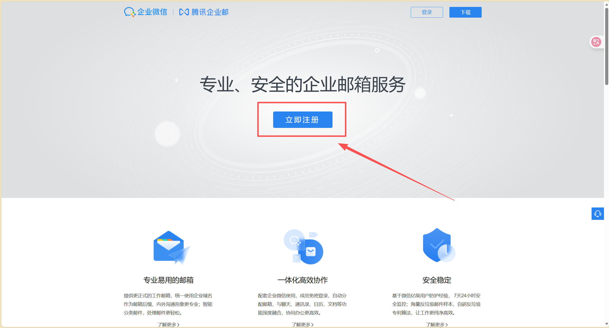

输入企业信息(可以随便填一填)和管理员信息，并用微信扫描二维码。

<!-- 这是一张图片，ocr 内容为： -->
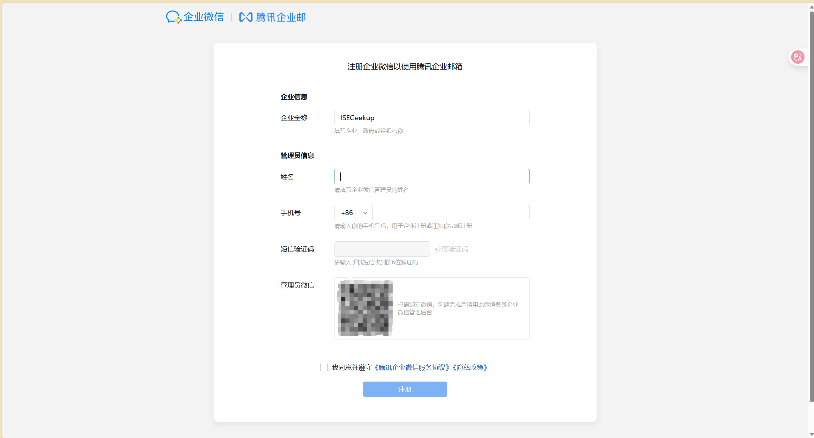

然后就可以进入**提交域名**页面，**输入刚刚注册的域名**，确保域名和后缀都是**正确的**，点击**提交域名**。

<!-- 这是一张图片，ocr 内容为： -->
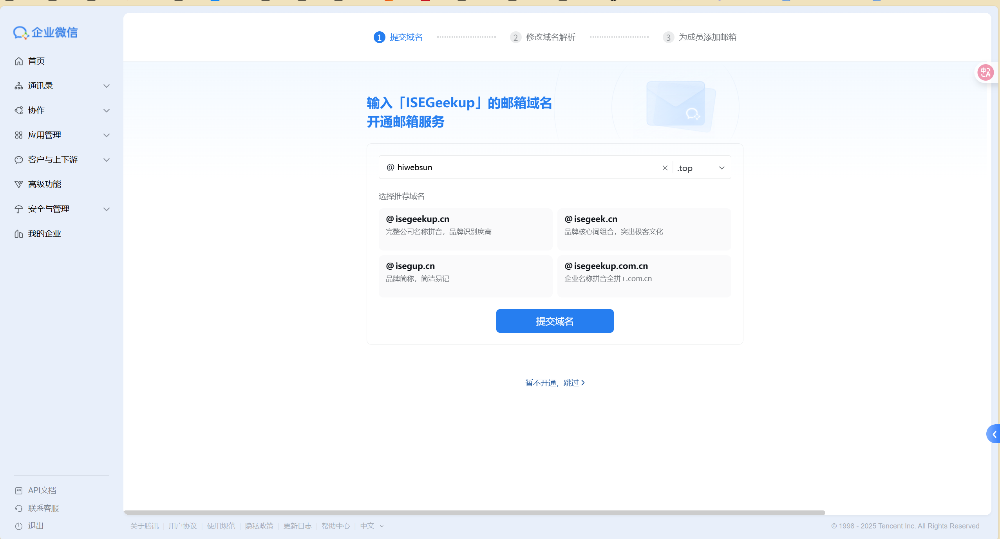

**修改域名解析**阶段，腾讯云注册域名的用户可以直接自动配置。

<!-- 这是一张图片，ocr 内容为： -->
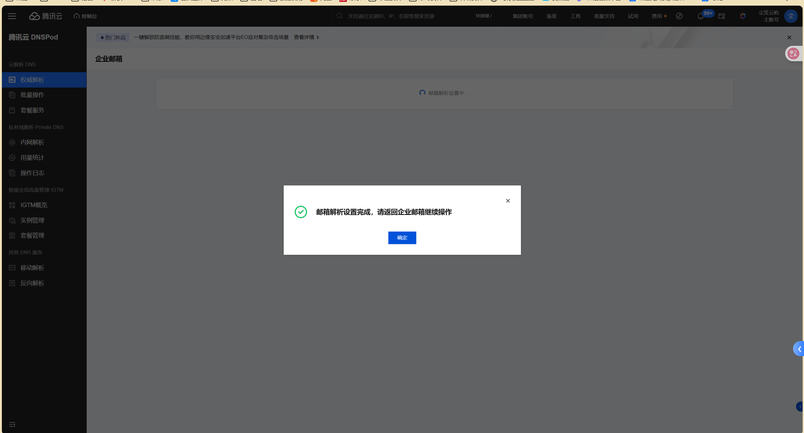

> 如果回到腾讯云，**域名注册-我的域名-解析**查看，能看到新增的三条记录。
>
> <!-- 这是一张图片，ocr 内容为： -->
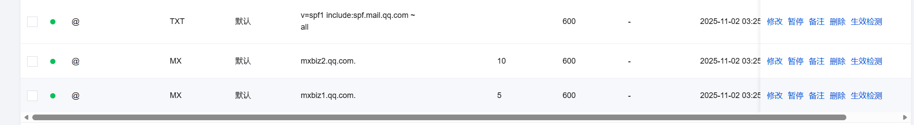
>

在最后阶段，管理员邮箱名默认是名字的全拼，你可以选择可以修改成你想要的邮箱名，这个邮箱已经自动激活。

<!-- 这是一张图片，ocr 内容为： -->
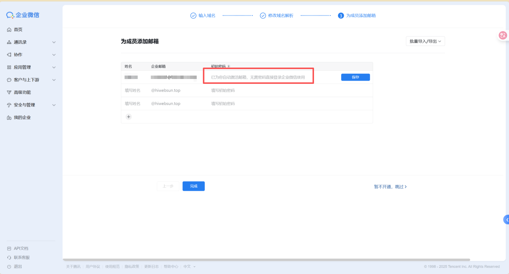

同样可以为成员添加邮箱并设置初始密码，但是需要成员验证激活邮箱。

<!-- 这是一张图片，ocr 内容为： -->
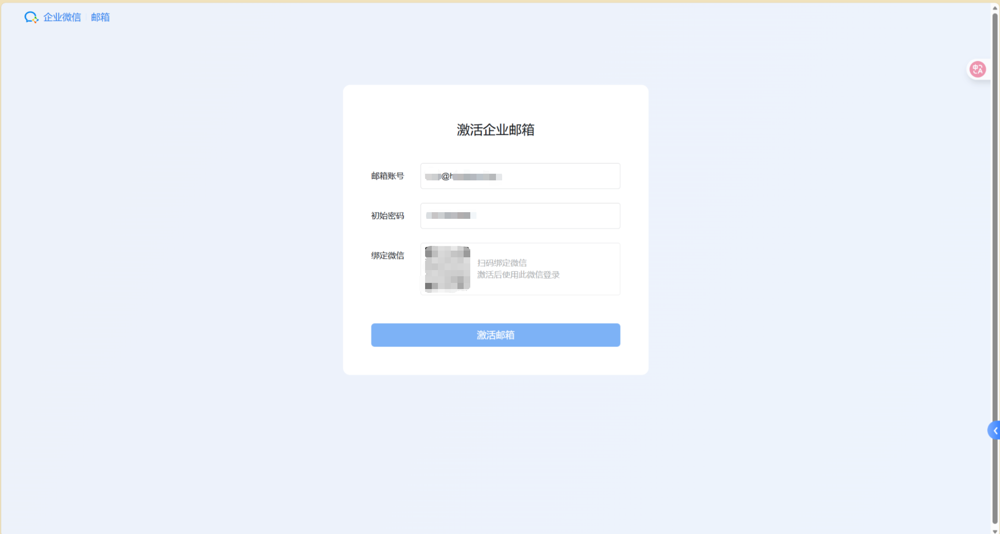

企业微信邮箱提供的基础版功能已经完全够用。

<!-- 这是一张图片，ocr 内容为： -->
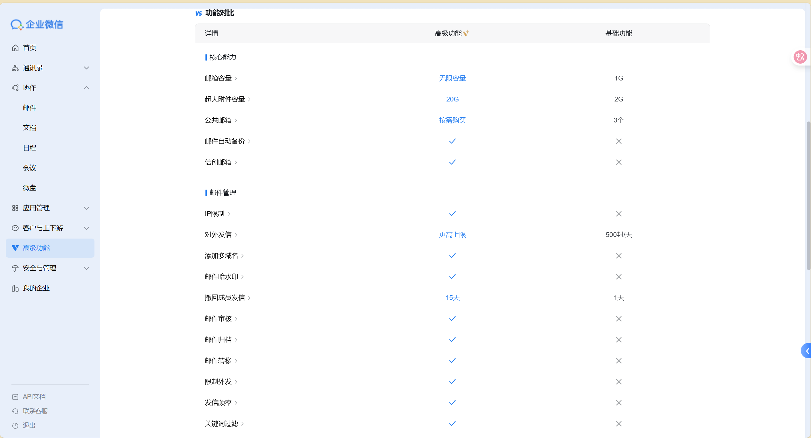

进入手机版企业微信，应该已经能看到新增了新注册的企业。

<!-- 这是一张图片，ocr 内容为： -->
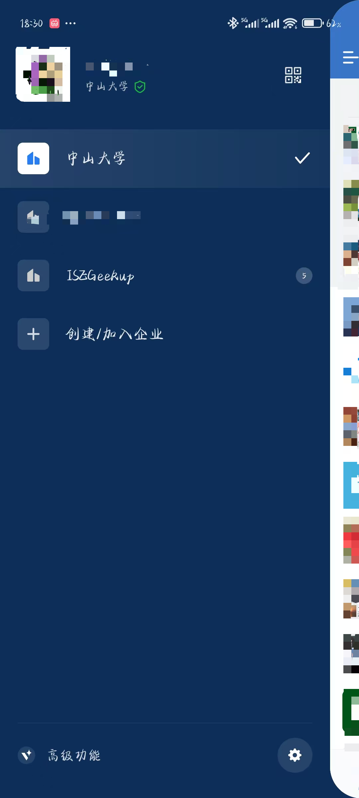

**进入新建的企业**，可以进入网页版企业微信邮箱[腾讯企业邮箱-登录入口](https://exmail.qq.com/login)，扫码登陆。

<!-- 这是一张图片，ocr 内容为： -->

可以在企业邮箱中收发邮件

<!-- 这是一张图片，ocr 内容为： -->
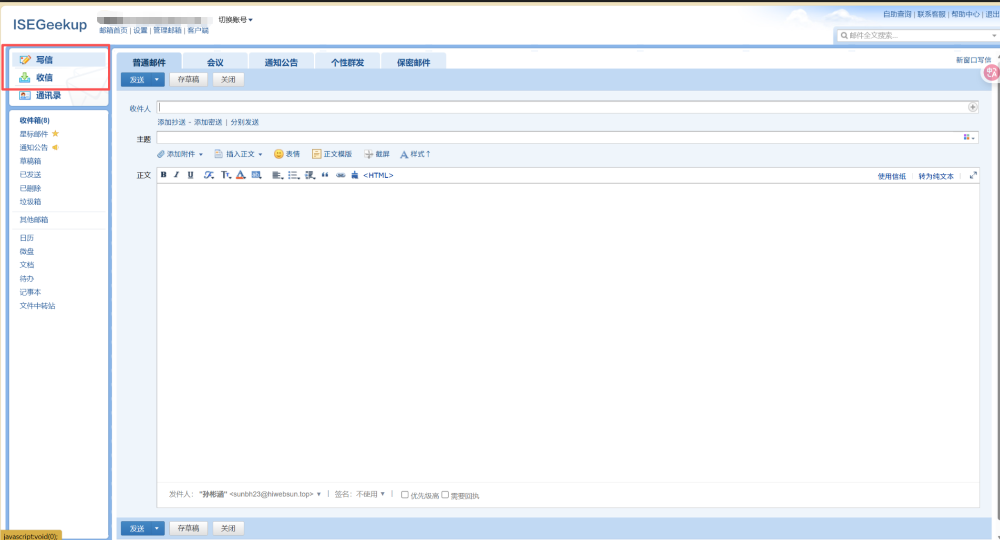

但是大家不经常登录这个邮箱，如何确保信息可以及时接收？

方法就是将所有邮件转发到你常用的邮箱中。

点击**设置-收发信设置-勾选两个服务**。

<!-- 这是一张图片，ocr 内容为： -->
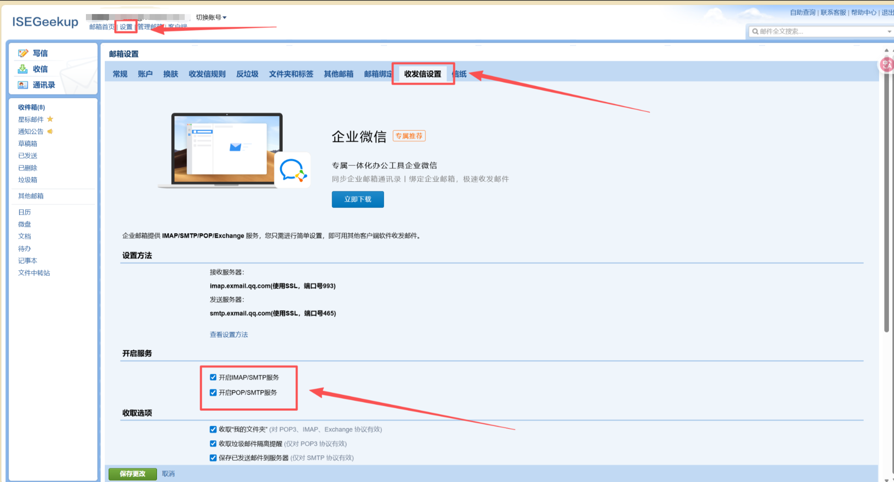

再点击**设置-常规-邮件自助转发**。

<!-- 这是一张图片，ocr 内容为： -->
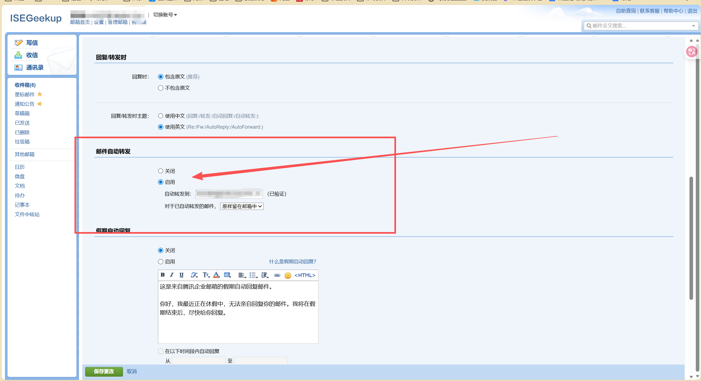

此时，常用邮箱会收到一个验证邮件，点击验证即可

<!-- 这是一张图片，ocr 内容为： -->
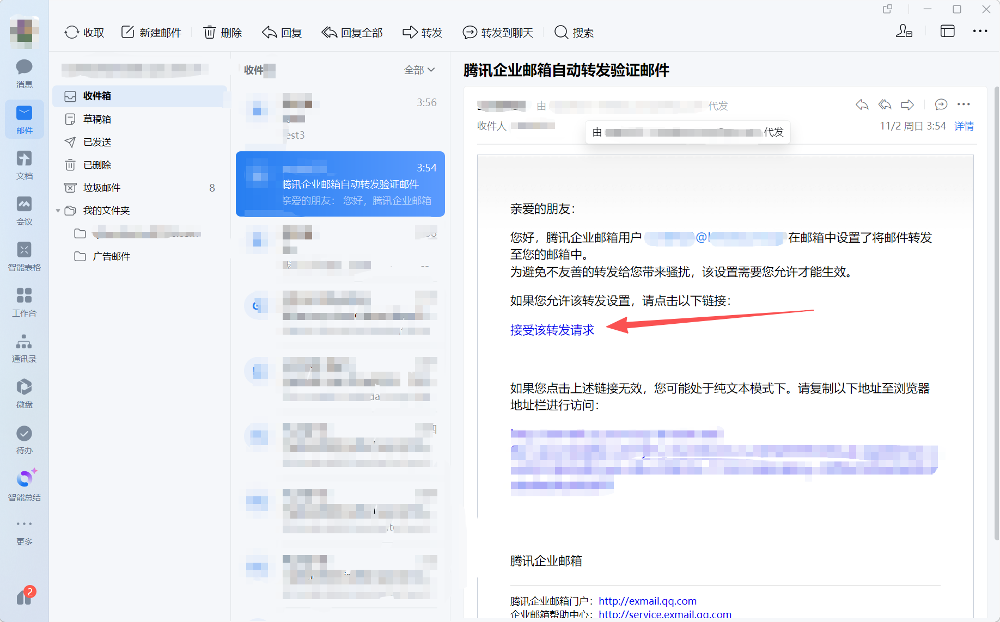

接下来，常用邮箱就可以收到转发的邮件，当然会有延迟。

<!-- 这是一张图片，ocr 内容为： -->
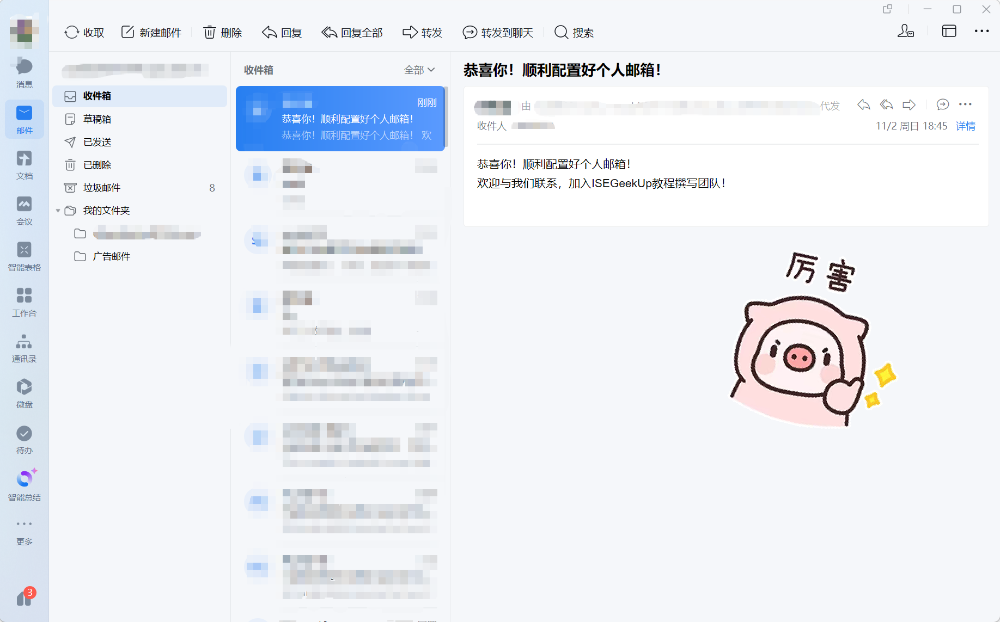

---

谢谢同学阅读到这里！

SYSUISEGeekUp团队

2025.11.02

